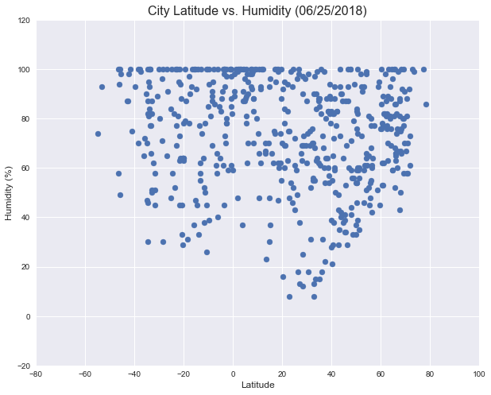
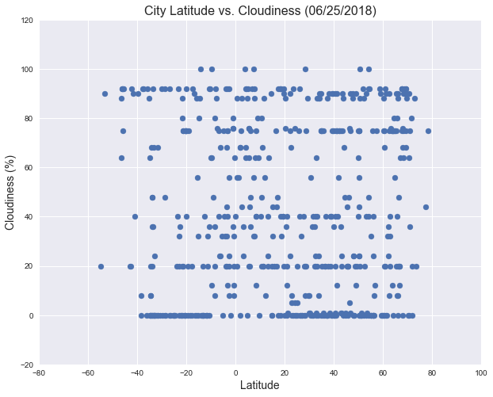
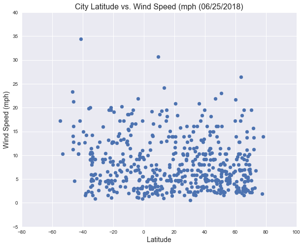

# WeatherPy - World Weather Analysis
Produced by Verna Orsatti
June 25,2018

# Analysis


The 4 data generated graphs for this assignment are: 
    * Temperature (F) against Latitude 
    * Humidity (%) against Latitude 
    * Cloudiness(%) against Latitude 
    * Wind Speed (mph) against Latitude

Trends:

Taking into consideration the time of year that the data for this report is collected, there will be a shift in values as the year changes through its seasons.  This report was generated at a instant in time where the days are longest in the northern hemisphere, and shortest in the southern hemisphere. Temperatures would be expected to be higher in the norther hemisphere at this time of year in the month of June. 

Upon viewing the  Temperature Plot, the graph is more uniform in a bell curve across the ranges of latitudes.  Given the time of year this was generated,  one would logically think that as in December/January the curve should slant down to the right, and in June/July the curve should slant down to the left.  However, it doesn't.  If data were to be collected over a year or more, and then averaged, a trend could be seen to see if this were just a day with overall outlier temperatures that were unusual, or if there are other factors, such as global warming in the southern hemisphere.  Questions to ask would be as an example, how the atmosphere ozone layer is improving or deteriorating that might affect such results as this. A historical analysis of data could show such relationships.

For the Humidity Plot, the values for cities reported are likely to be affected by location to water. General world daily weather patterns also come in to play. Less randomly generated location points are found in latitudes where water dominates than in latitudes with more land mass.  The proportion of land to water is much higher in the northern hemisphere as reported by Wikipedia as being close to 80% land to 20% water. Locations shown in those latitudes with larger land masses are likely to be reporting dryer conditions, such as those inland locations with deserts. This chart is not as likely to be affected by the seasons except for the atmosphere’s ability to hold water in cold temperatures vs warm temperatures.

Cloudiness is also subject to atmospheric weather patterns for the day. For today's date there seems to be show more numerous pattern of cloudy weather outside the lower equator belt. In comparison of this chart with the Example chart given for this assignment that was taken in January, that same break in cloudiness exists in both charts which might indicate that the weather patterns might be generally sunnier that region of latitudes.

With the Wind Speed chart, values are likely affected by season.  Although there is less data for the southernmost latitudes, there are some high outliers.  As referred to in the previous analysis, the Wind plot in the example given for December/January shows higher values in the upper end latitudes, which would be in winter months on that chart.  This is opposite to values shown for this chart of June.  

Of course, land and water formations, along with current weather patterns will all affect these charts on any given day, and a true analysis would be better viewed over the averages over a larger time period.

Supplemental information and input:

For the production of the results, the manner in which the data is generated leaves room for interpretation.  A better representation of points on the included figures for locations of data collected would be to create bins for latitude range, and randomly select citiy data to fill those bins as equally as possible to eliminate the quantity factor of the number of cities in a latitude range that can affect the perceived result.  With a bin method of collecting data , analyzing vertical columns of data over the x axis of latitudes on the graphs are likely to show clearer trends. 

Also, to randomly select from known cities from an aggregate database would eliminate false connections between randomly created coordinates and locations of cities - a problem in this method that chooses a city based on coordinates that may fall anywhere on water or on land that may not be in a reasonably close are to the city provided by enclosed data method.  Openweathermap does provide a data file of over 200,000 cities in which a randome list could be created per latitude range.

For this assigment, the method required to use was utilizing the randomly selected coordinates to find a city nearby through citipy.  Data from those cities was then collected through OpenWeatherMaps, and plotted into 4 graphs of selected data, plotted against latitude values in a scatterplot.


# Main Code & Table of Data


```python
# Dependencies and Setup
import matplotlib.pyplot as plt
import pandas as pd
import numpy as np
import requests
import json
import seaborn as sns
import datetime
import time

#Report Date
now = datetime.datetime.now()
today = now.strftime("%m/%d/%Y")

# Import API key
#import api_keys.py
api_key = "your code here"

# Incorporated citipy to determine city based on latitude and longitude
from citipy import citipy

# Create figures using seaborn and matplotlib
sns.set()

# Output File (CSV)
output_data_file = "output_data_cities.csv"

# Range of latitudes and longitudes
lat_range = (-90, 90)
lng_range = (-180, 180)

```


```python
# Generate Cities list from numpy random & citypy
lat_lngs = []
cities = []
duplicate_cities= []
coords = [] #using this as an added column to show random citipy coords 
lats = []
lngs = []
countries = []
no_dup_lats = []
no_dup_lngs = []

# Size the random sample here 
size = 1500

# Create a set of random lat and lng combinations = 15 to start
print("Preparing random set of coordinates and nearest city from citipy...")

lats = np.random.uniform(low=-90.000, high=90.000, size=size)
lngs = np.random.uniform(low=-180.000, high=180.000, size=size)
lat_lngs = zip(lats, lngs)

for lat_lng in lat_lngs:
    city = citipy.nearest_city(lat_lng[0], lat_lng[1]).city_name
    country = citipy.nearest_city(lat_lng[0], lat_lng[1]).country_code
        
    if city not in cities:        
        cities.append(city) # list of unique random cities - all
        coords.append(lat_lng) # list of each city's coordinates - all
        countries.append(country)
        no_dup_lats.append(lat_lng[0])
        no_dup_lngs.append(lat_lng[1])
    else:
        #print("Duplicate city found, skipping: ", country,". City ", city," ",lat_lng)
        duplicate_cities.append(city)
        
# Print the city count to confirm sufficient count
print()
print(f"Out of {size} randomly selected cities, there were {len(duplicate_cities)} duplicates.") 
# print(f"These duplicate cities are excluded from the results: {duplicate_cities}") # Option to print duplicated cities
```

    Preparing random set of coordinates and nearest city from citipy...
    
    Out of 1500 randomly selected cities, there were 869 duplicates.


```python
# Create dataframe for values
# Columna in example show they are alphabetized
columns = ["City","coords","Cloudiness","Country","Date","Humidity","Lat","Lng","Max Temp","Wind Speed"]
cities_df = pd.DataFrame(columns=columns)

# Fill with data from Citipy
cities_df['City'] = cities # Citipy cities 
cities_df['coords'] = coords # Added colomn for random generated coords from citipy 
cities_df['Country'] = countries # Citipy country code
cities_df['Lat'] = no_dup_lats # format later with openweathermap's actual lat lon per city
cities_df['Lng'] = no_dup_lngs # format later with openweathermap's actual lat lon per city
```

## Perform API Calls


```python
# API options from openweathermap.org
url = "http://api.openweathermap.org/data/2.5/weather?" 
units = "imperial"

for index, row in cities_df.iterrows():   
    try:
        #data from citipy
        df_city = row['City']
        df_country = row['Country']
        
        # Get city/country data from openweather
        query_url = url + "appid=" + api_key + "&units=" + units + "&q=" + df_city +"," + df_country
        response = requests.get(query_url).json()
        
        print(f"Processing city record {index} | ",df_city,", ",df_country)
        print(query_url)
        
        # Openweathermaps allows 60 calls per minute on free plan
        time.sleep(1) 
        
        # Get weather data 
        df_cloud = response["clouds"]["all"]
        df_date = response["dt"]
        df_humidity = response["main"]["humidity"]
        df_maxtemp = response["main"]["temp_max"]
        df_wind = response["wind"]["speed"]
        
        # Replace actual formatted coords per city  from openweathermaps
        df_lat = "{:0.2f}".format(response["coord"]["lat"]) 
        df_lng = "{:0.2f}".format(response["coord"]["lon"])
        
        # Add to dataframe - new way for future use
        cities_df.at[index,"Cloudiness"] = df_cloud
        cities_df.at[index,"Date"] = df_date
        cities_df.at[index,"Humidity"] = df_humidity
        cities_df.at[index,"Lat"] = df_lat
        cities_df.at[index,"Lng"] = df_lng
        cities_df.at[index, "Max Temp"] = df_maxtemp
        cities_df.at[index, "Wind Speed"] = df_wind
                
    except:
        print(f"Invalid city/country, {df_city} / {df_country}, skipping... ")
               
```

    Processing city record 0 |  hobart ,  au
    http://api.openweathermap.org/data/2.5/weather?appid=e7417750fa93ecd29eee7734eae3d649&units=imperial&q=hobart,au
    Processing city record 1 |  cidreira ,  br
    http://api.openweathermap.org/data/2.5/weather?appid=e7417750fa93ecd29eee7734eae3d649&units=imperial&q=cidreira,br
    Processing city record 2 |  arona ,  es
    http://api.openweathermap.org/data/2.5/weather?appid=e7417750fa93ecd29eee7734eae3d649&units=imperial&q=arona,es
    Processing city record 3 |  tuktoyaktuk ,  ca
    http://api.openweathermap.org/data/2.5/weather?appid=e7417750fa93ecd29eee7734eae3d649&units=imperial&q=tuktoyaktuk,ca
    Processing city record 4 |  kruisfontein ,  za
    http://api.openweathermap.org/data/2.5/weather?appid=e7417750fa93ecd29eee7734eae3d649&units=imperial&q=kruisfontein,za
    Processing city record 5 |  punta arenas ,  cl
    http://api.openweathermap.org/data/2.5/weather?appid=e7417750fa93ecd29eee7734eae3d649&units=imperial&q=punta arenas,cl
    Processing city record 6 |  tessalit ,  ml
    http://api.openweathermap.org/data/2.5/weather?appid=e7417750fa93ecd29eee7734eae3d649&units=imperial&q=tessalit,ml
    Processing city record 7 |  udachnyy ,  ru
    http://api.openweathermap.org/data/2.5/weather?appid=e7417750fa93ecd29eee7734eae3d649&units=imperial&q=udachnyy,ru
    Processing city record 8 |  arcata ,  us
    http://api.openweathermap.org/data/2.5/weather?appid=e7417750fa93ecd29eee7734eae3d649&units=imperial&q=arcata,us
    Processing city record 9 |  ushuaia ,  ar
    http://api.openweathermap.org/data/2.5/weather?appid=e7417750fa93ecd29eee7734eae3d649&units=imperial&q=ushuaia,ar
    Processing city record 10 |  hermanus ,  za
    http://api.openweathermap.org/data/2.5/weather?appid=e7417750fa93ecd29eee7734eae3d649&units=imperial&q=hermanus,za
    Processing city record 11 |  bababe ,  mr
    http://api.openweathermap.org/data/2.5/weather?appid=e7417750fa93ecd29eee7734eae3d649&units=imperial&q=bababe,mr
    Invalid city/country, bababe / mr, skipping... 
    Processing city record 12 |  butaritari ,  ki
    http://api.openweathermap.org/data/2.5/weather?appid=e7417750fa93ecd29eee7734eae3d649&units=imperial&q=butaritari,ki
    Processing city record 13 |  dwarahat ,  in
    http://api.openweathermap.org/data/2.5/weather?appid=e7417750fa93ecd29eee7734eae3d649&units=imperial&q=dwarahat,in
    Processing city record 14 |  vaini ,  to
    http://api.openweathermap.org/data/2.5/weather?appid=e7417750fa93ecd29eee7734eae3d649&units=imperial&q=vaini,to
    Processing city record 15 |  usinsk ,  ru
    http://api.openweathermap.org/data/2.5/weather?appid=e7417750fa93ecd29eee7734eae3d649&units=imperial&q=usinsk,ru
    Processing city record 16 |  arraial do cabo ,  br
    http://api.openweathermap.org/data/2.5/weather?appid=e7417750fa93ecd29eee7734eae3d649&units=imperial&q=arraial do cabo,br
    Processing city record 17 |  saint pete beach ,  us
    http://api.openweathermap.org/data/2.5/weather?appid=e7417750fa93ecd29eee7734eae3d649&units=imperial&q=saint pete beach,us
    Processing city record 18 |  dingle ,  ie
    http://api.openweathermap.org/data/2.5/weather?appid=e7417750fa93ecd29eee7734eae3d649&units=imperial&q=dingle,ie
    Processing city record 19 |  saskylakh ,  ru
    http://api.openweathermap.org/data/2.5/weather?appid=e7417750fa93ecd29eee7734eae3d649&units=imperial&q=saskylakh,ru
    Processing city record 20 |  kattivakkam ,  in
    http://api.openweathermap.org/data/2.5/weather?appid=e7417750fa93ecd29eee7734eae3d649&units=imperial&q=kattivakkam,in
    Processing city record 21 |  mataura ,  pf
    http://api.openweathermap.org/data/2.5/weather?appid=e7417750fa93ecd29eee7734eae3d649&units=imperial&q=mataura,pf
    Invalid city/country, mataura / pf, skipping... 
    Processing city record 22 |  olenegorsk ,  ru
    http://api.openweathermap.org/data/2.5/weather?appid=e7417750fa93ecd29eee7734eae3d649&units=imperial&q=olenegorsk,ru
    Processing city record 23 |  ambilobe ,  mg
    http://api.openweathermap.org/data/2.5/weather?appid=e7417750fa93ecd29eee7734eae3d649&units=imperial&q=ambilobe,mg
    Processing city record 24 |  bubaque ,  gw
    http://api.openweathermap.org/data/2.5/weather?appid=e7417750fa93ecd29eee7734eae3d649&units=imperial&q=bubaque,gw
    Processing city record 25 |  san patricio ,  mx
    http://api.openweathermap.org/data/2.5/weather?appid=e7417750fa93ecd29eee7734eae3d649&units=imperial&q=san patricio,mx
    Processing city record 26 |  thohoyandou ,  za
    http://api.openweathermap.org/data/2.5/weather?appid=e7417750fa93ecd29eee7734eae3d649&units=imperial&q=thohoyandou,za
    Processing city record 27 |  cape town ,  za
    http://api.openweathermap.org/data/2.5/weather?appid=e7417750fa93ecd29eee7734eae3d649&units=imperial&q=cape town,za
    Processing city record 28 |  orcopampa ,  pe
    http://api.openweathermap.org/data/2.5/weather?appid=e7417750fa93ecd29eee7734eae3d649&units=imperial&q=orcopampa,pe
    Processing city record 29 |  ugoofaaru ,  mv
    http://api.openweathermap.org/data/2.5/weather?appid=e7417750fa93ecd29eee7734eae3d649&units=imperial&q=ugoofaaru,mv
    Processing city record 30 |  saint-augustin ,  ca
    http://api.openweathermap.org/data/2.5/weather?appid=e7417750fa93ecd29eee7734eae3d649&units=imperial&q=saint-augustin,ca
    Processing city record 31 |  aykhal ,  ru
    http://api.openweathermap.org/data/2.5/weather?appid=e7417750fa93ecd29eee7734eae3d649&units=imperial&q=aykhal,ru
    Processing city record 32 |  carnarvon ,  au
    http://api.openweathermap.org/data/2.5/weather?appid=e7417750fa93ecd29eee7734eae3d649&units=imperial&q=carnarvon,au
    Processing city record 33 |  jamestown ,  sh
    http://api.openweathermap.org/data/2.5/weather?appid=e7417750fa93ecd29eee7734eae3d649&units=imperial&q=jamestown,sh
    Processing city record 34 |  wajir ,  ke
    http://api.openweathermap.org/data/2.5/weather?appid=e7417750fa93ecd29eee7734eae3d649&units=imperial&q=wajir,ke
    Processing city record 35 |  sisimiut ,  gl
    http://api.openweathermap.org/data/2.5/weather?appid=e7417750fa93ecd29eee7734eae3d649&units=imperial&q=sisimiut,gl
    Processing city record 36 |  clyde river ,  ca
    http://api.openweathermap.org/data/2.5/weather?appid=e7417750fa93ecd29eee7734eae3d649&units=imperial&q=clyde river,ca
    Processing city record 37 |  hambantota ,  lk
    http://api.openweathermap.org/data/2.5/weather?appid=e7417750fa93ecd29eee7734eae3d649&units=imperial&q=hambantota,lk
    Processing city record 38 |  sabang ,  id
    http://api.openweathermap.org/data/2.5/weather?appid=e7417750fa93ecd29eee7734eae3d649&units=imperial&q=sabang,id
    Processing city record 39 |  kholodnyy ,  ru
    http://api.openweathermap.org/data/2.5/weather?appid=e7417750fa93ecd29eee7734eae3d649&units=imperial&q=kholodnyy,ru
    Processing city record 40 |  belushya guba ,  ru
    http://api.openweathermap.org/data/2.5/weather?appid=e7417750fa93ecd29eee7734eae3d649&units=imperial&q=belushya guba,ru
    Invalid city/country, belushya guba / ru, skipping... 
    Processing city record 41 |  quijingue ,  br
    http://api.openweathermap.org/data/2.5/weather?appid=e7417750fa93ecd29eee7734eae3d649&units=imperial&q=quijingue,br
    Processing city record 42 |  comodoro rivadavia ,  ar
    http://api.openweathermap.org/data/2.5/weather?appid=e7417750fa93ecd29eee7734eae3d649&units=imperial&q=comodoro rivadavia,ar
    Processing city record 43 |  kaitangata ,  nz
    http://api.openweathermap.org/data/2.5/weather?appid=e7417750fa93ecd29eee7734eae3d649&units=imperial&q=kaitangata,nz
    Processing city record 44 |  torbay ,  ca
    http://api.openweathermap.org/data/2.5/weather?appid=e7417750fa93ecd29eee7734eae3d649&units=imperial&q=torbay,ca
    Processing city record 45 |  sentyabrskiy ,  ru
    http://api.openweathermap.org/data/2.5/weather?appid=e7417750fa93ecd29eee7734eae3d649&units=imperial&q=sentyabrskiy,ru
    Invalid city/country, sentyabrskiy / ru, skipping... 
    Processing city record 46 |  eirunepe ,  br
    http://api.openweathermap.org/data/2.5/weather?appid=e7417750fa93ecd29eee7734eae3d649&units=imperial&q=eirunepe,br
    Processing city record 47 |  provideniya ,  ru
    http://api.openweathermap.org/data/2.5/weather?appid=e7417750fa93ecd29eee7734eae3d649&units=imperial&q=provideniya,ru
    Processing city record 48 |  kanata ,  ca
    http://api.openweathermap.org/data/2.5/weather?appid=e7417750fa93ecd29eee7734eae3d649&units=imperial&q=kanata,ca
    Processing city record 49 |  rikitea ,  pf
    http://api.openweathermap.org/data/2.5/weather?appid=e7417750fa93ecd29eee7734eae3d649&units=imperial&q=rikitea,pf
    Processing city record 50 |  khorixas ,  na
    http://api.openweathermap.org/data/2.5/weather?appid=e7417750fa93ecd29eee7734eae3d649&units=imperial&q=khorixas,na
    Processing city record 51 |  kapaa ,  us
    http://api.openweathermap.org/data/2.5/weather?appid=e7417750fa93ecd29eee7734eae3d649&units=imperial&q=kapaa,us
    Processing city record 52 |  bolonchen ,  mx
    http://api.openweathermap.org/data/2.5/weather?appid=e7417750fa93ecd29eee7734eae3d649&units=imperial&q=bolonchen,mx
    Invalid city/country, bolonchen / mx, skipping... 
    Processing city record 53 |  puerto ayora ,  ec
    http://api.openweathermap.org/data/2.5/weather?appid=e7417750fa93ecd29eee7734eae3d649&units=imperial&q=puerto ayora,ec
    Processing city record 54 |  krasnyy luch ,  ru
    http://api.openweathermap.org/data/2.5/weather?appid=e7417750fa93ecd29eee7734eae3d649&units=imperial&q=krasnyy luch,ru
    Processing city record 55 |  qaqortoq ,  gl
    http://api.openweathermap.org/data/2.5/weather?appid=e7417750fa93ecd29eee7734eae3d649&units=imperial&q=qaqortoq,gl
    Processing city record 56 |  busselton ,  au
    http://api.openweathermap.org/data/2.5/weather?appid=e7417750fa93ecd29eee7734eae3d649&units=imperial&q=busselton,au
    Processing city record 57 |  san juan ,  us
    http://api.openweathermap.org/data/2.5/weather?appid=e7417750fa93ecd29eee7734eae3d649&units=imperial&q=san juan,us
    Processing city record 58 |  krasnaya gorka ,  ru
    http://api.openweathermap.org/data/2.5/weather?appid=e7417750fa93ecd29eee7734eae3d649&units=imperial&q=krasnaya gorka,ru
    Processing city record 59 |  barrow ,  us
    http://api.openweathermap.org/data/2.5/weather?appid=e7417750fa93ecd29eee7734eae3d649&units=imperial&q=barrow,us
    Processing city record 60 |  port-gentil ,  ga
    http://api.openweathermap.org/data/2.5/weather?appid=e7417750fa93ecd29eee7734eae3d649&units=imperial&q=port-gentil,ga
    Processing city record 61 |  mar del plata ,  ar
    http://api.openweathermap.org/data/2.5/weather?appid=e7417750fa93ecd29eee7734eae3d649&units=imperial&q=mar del plata,ar
    Processing city record 62 |  bredasdorp ,  za
    http://api.openweathermap.org/data/2.5/weather?appid=e7417750fa93ecd29eee7734eae3d649&units=imperial&q=bredasdorp,za
    Processing city record 63 |  hamilton ,  bm
    http://api.openweathermap.org/data/2.5/weather?appid=e7417750fa93ecd29eee7734eae3d649&units=imperial&q=hamilton,bm
    Processing city record 64 |  alghero ,  it
    http://api.openweathermap.org/data/2.5/weather?appid=e7417750fa93ecd29eee7734eae3d649&units=imperial&q=alghero,it
    Processing city record 65 |  hilo ,  us
    http://api.openweathermap.org/data/2.5/weather?appid=e7417750fa93ecd29eee7734eae3d649&units=imperial&q=hilo,us
    Processing city record 66 |  ust-kamchatsk ,  ru
    http://api.openweathermap.org/data/2.5/weather?appid=e7417750fa93ecd29eee7734eae3d649&units=imperial&q=ust-kamchatsk,ru
    Invalid city/country, ust-kamchatsk / ru, skipping... 
    Processing city record 67 |  wewak ,  pg
    http://api.openweathermap.org/data/2.5/weather?appid=e7417750fa93ecd29eee7734eae3d649&units=imperial&q=wewak,pg
    Processing city record 68 |  aksu ,  cn
    http://api.openweathermap.org/data/2.5/weather?appid=e7417750fa93ecd29eee7734eae3d649&units=imperial&q=aksu,cn
    Processing city record 69 |  eregli ,  tr
    http://api.openweathermap.org/data/2.5/weather?appid=e7417750fa93ecd29eee7734eae3d649&units=imperial&q=eregli,tr
    Processing city record 70 |  tiksi ,  ru
    http://api.openweathermap.org/data/2.5/weather?appid=e7417750fa93ecd29eee7734eae3d649&units=imperial&q=tiksi,ru
    Processing city record 71 |  jyvaskyla ,  fi
    http://api.openweathermap.org/data/2.5/weather?appid=e7417750fa93ecd29eee7734eae3d649&units=imperial&q=jyvaskyla,fi
    Invalid city/country, jyvaskyla / fi, skipping... 
    Processing city record 72 |  ciudad bolivar ,  ve
    http://api.openweathermap.org/data/2.5/weather?appid=e7417750fa93ecd29eee7734eae3d649&units=imperial&q=ciudad bolivar,ve
    Processing city record 73 |  plouzane ,  fr
    http://api.openweathermap.org/data/2.5/weather?appid=e7417750fa93ecd29eee7734eae3d649&units=imperial&q=plouzane,fr
    Processing city record 74 |  gazli ,  uz
    http://api.openweathermap.org/data/2.5/weather?appid=e7417750fa93ecd29eee7734eae3d649&units=imperial&q=gazli,uz
    Processing city record 75 |  whitehorse ,  ca
    http://api.openweathermap.org/data/2.5/weather?appid=e7417750fa93ecd29eee7734eae3d649&units=imperial&q=whitehorse,ca
    Processing city record 76 |  lukoyanov ,  ru
    http://api.openweathermap.org/data/2.5/weather?appid=e7417750fa93ecd29eee7734eae3d649&units=imperial&q=lukoyanov,ru
    Processing city record 77 |  iracoubo ,  gf
    http://api.openweathermap.org/data/2.5/weather?appid=e7417750fa93ecd29eee7734eae3d649&units=imperial&q=iracoubo,gf
    Processing city record 78 |  nabire ,  id
    http://api.openweathermap.org/data/2.5/weather?appid=e7417750fa93ecd29eee7734eae3d649&units=imperial&q=nabire,id
    Processing city record 79 |  ayagoz ,  kz
    http://api.openweathermap.org/data/2.5/weather?appid=e7417750fa93ecd29eee7734eae3d649&units=imperial&q=ayagoz,kz
    Processing city record 80 |  atuona ,  pf
    http://api.openweathermap.org/data/2.5/weather?appid=e7417750fa93ecd29eee7734eae3d649&units=imperial&q=atuona,pf
    Processing city record 81 |  ivrea ,  it
    http://api.openweathermap.org/data/2.5/weather?appid=e7417750fa93ecd29eee7734eae3d649&units=imperial&q=ivrea,it
    Processing city record 82 |  nizhnyaya poyma ,  ru
    http://api.openweathermap.org/data/2.5/weather?appid=e7417750fa93ecd29eee7734eae3d649&units=imperial&q=nizhnyaya poyma,ru
    Processing city record 83 |  port alfred ,  za
    http://api.openweathermap.org/data/2.5/weather?appid=e7417750fa93ecd29eee7734eae3d649&units=imperial&q=port alfred,za
    Processing city record 84 |  saldanha ,  za
    http://api.openweathermap.org/data/2.5/weather?appid=e7417750fa93ecd29eee7734eae3d649&units=imperial&q=saldanha,za
    Processing city record 85 |  newport ,  us
    http://api.openweathermap.org/data/2.5/weather?appid=e7417750fa93ecd29eee7734eae3d649&units=imperial&q=newport,us
    Processing city record 86 |  mahebourg ,  mu
    http://api.openweathermap.org/data/2.5/weather?appid=e7417750fa93ecd29eee7734eae3d649&units=imperial&q=mahebourg,mu
    Processing city record 87 |  samarai ,  pg
    http://api.openweathermap.org/data/2.5/weather?appid=e7417750fa93ecd29eee7734eae3d649&units=imperial&q=samarai,pg
    Processing city record 88 |  hihifo ,  to
    http://api.openweathermap.org/data/2.5/weather?appid=e7417750fa93ecd29eee7734eae3d649&units=imperial&q=hihifo,to
    Invalid city/country, hihifo / to, skipping... 
    Processing city record 89 |  dongsheng ,  cn
    http://api.openweathermap.org/data/2.5/weather?appid=e7417750fa93ecd29eee7734eae3d649&units=imperial&q=dongsheng,cn
    Processing city record 90 |  havre-saint-pierre ,  ca
    http://api.openweathermap.org/data/2.5/weather?appid=e7417750fa93ecd29eee7734eae3d649&units=imperial&q=havre-saint-pierre,ca
    Processing city record 91 |  hithadhoo ,  mv
    http://api.openweathermap.org/data/2.5/weather?appid=e7417750fa93ecd29eee7734eae3d649&units=imperial&q=hithadhoo,mv
    Processing city record 92 |  esperance ,  au
    http://api.openweathermap.org/data/2.5/weather?appid=e7417750fa93ecd29eee7734eae3d649&units=imperial&q=esperance,au
    Processing city record 93 |  bathsheba ,  bb
    http://api.openweathermap.org/data/2.5/weather?appid=e7417750fa93ecd29eee7734eae3d649&units=imperial&q=bathsheba,bb
    Processing city record 94 |  inhambane ,  mz
    http://api.openweathermap.org/data/2.5/weather?appid=e7417750fa93ecd29eee7734eae3d649&units=imperial&q=inhambane,mz
    Processing city record 95 |  qarqin ,  af
    http://api.openweathermap.org/data/2.5/weather?appid=e7417750fa93ecd29eee7734eae3d649&units=imperial&q=qarqin,af
    Processing city record 96 |  mareeba ,  au
    http://api.openweathermap.org/data/2.5/weather?appid=e7417750fa93ecd29eee7734eae3d649&units=imperial&q=mareeba,au
    Processing city record 97 |  innisfail ,  au
    http://api.openweathermap.org/data/2.5/weather?appid=e7417750fa93ecd29eee7734eae3d649&units=imperial&q=innisfail,au
    Processing city record 98 |  faanui ,  pf
    http://api.openweathermap.org/data/2.5/weather?appid=e7417750fa93ecd29eee7734eae3d649&units=imperial&q=faanui,pf
    Processing city record 99 |  ayan ,  ru
    http://api.openweathermap.org/data/2.5/weather?appid=e7417750fa93ecd29eee7734eae3d649&units=imperial&q=ayan,ru
    Invalid city/country, ayan / ru, skipping... 
    Processing city record 100 |  beringovskiy ,  ru
    http://api.openweathermap.org/data/2.5/weather?appid=e7417750fa93ecd29eee7734eae3d649&units=imperial&q=beringovskiy,ru
    Processing city record 101 |  hasaki ,  jp
    http://api.openweathermap.org/data/2.5/weather?appid=e7417750fa93ecd29eee7734eae3d649&units=imperial&q=hasaki,jp
    Processing city record 102 |  padang ,  id
    http://api.openweathermap.org/data/2.5/weather?appid=e7417750fa93ecd29eee7734eae3d649&units=imperial&q=padang,id
    Processing city record 103 |  marcona ,  pe
    http://api.openweathermap.org/data/2.5/weather?appid=e7417750fa93ecd29eee7734eae3d649&units=imperial&q=marcona,pe
    Invalid city/country, marcona / pe, skipping... 
    Processing city record 104 |  lensk ,  ru
    http://api.openweathermap.org/data/2.5/weather?appid=e7417750fa93ecd29eee7734eae3d649&units=imperial&q=lensk,ru
    Processing city record 105 |  kavieng ,  pg
    http://api.openweathermap.org/data/2.5/weather?appid=e7417750fa93ecd29eee7734eae3d649&units=imperial&q=kavieng,pg
    Processing city record 106 |  miandrivazo ,  mg
    http://api.openweathermap.org/data/2.5/weather?appid=e7417750fa93ecd29eee7734eae3d649&units=imperial&q=miandrivazo,mg
    Processing city record 107 |  praia ,  cv
    http://api.openweathermap.org/data/2.5/weather?appid=e7417750fa93ecd29eee7734eae3d649&units=imperial&q=praia,cv
    Processing city record 108 |  avarua ,  ck
    http://api.openweathermap.org/data/2.5/weather?appid=e7417750fa93ecd29eee7734eae3d649&units=imperial&q=avarua,ck
    Processing city record 109 |  nara ,  ml
    http://api.openweathermap.org/data/2.5/weather?appid=e7417750fa93ecd29eee7734eae3d649&units=imperial&q=nara,ml
    Processing city record 110 |  changji ,  cn
    http://api.openweathermap.org/data/2.5/weather?appid=e7417750fa93ecd29eee7734eae3d649&units=imperial&q=changji,cn
    Processing city record 111 |  chuy ,  uy
    http://api.openweathermap.org/data/2.5/weather?appid=e7417750fa93ecd29eee7734eae3d649&units=imperial&q=chuy,uy
    Processing city record 112 |  galle ,  lk
    http://api.openweathermap.org/data/2.5/weather?appid=e7417750fa93ecd29eee7734eae3d649&units=imperial&q=galle,lk
    Processing city record 113 |  peniche ,  pt
    http://api.openweathermap.org/data/2.5/weather?appid=e7417750fa93ecd29eee7734eae3d649&units=imperial&q=peniche,pt
    Processing city record 114 |  tsihombe ,  mg
    http://api.openweathermap.org/data/2.5/weather?appid=e7417750fa93ecd29eee7734eae3d649&units=imperial&q=tsihombe,mg
    Invalid city/country, tsihombe / mg, skipping... 
    Processing city record 115 |  manaus ,  br
    http://api.openweathermap.org/data/2.5/weather?appid=e7417750fa93ecd29eee7734eae3d649&units=imperial&q=manaus,br
    Processing city record 116 |  borzya ,  ru
    http://api.openweathermap.org/data/2.5/weather?appid=e7417750fa93ecd29eee7734eae3d649&units=imperial&q=borzya,ru
    Processing city record 117 |  bodden town ,  ky
    http://api.openweathermap.org/data/2.5/weather?appid=e7417750fa93ecd29eee7734eae3d649&units=imperial&q=bodden town,ky
    Processing city record 118 |  dunedin ,  nz
    http://api.openweathermap.org/data/2.5/weather?appid=e7417750fa93ecd29eee7734eae3d649&units=imperial&q=dunedin,nz
    Processing city record 119 |  taolanaro ,  mg
    http://api.openweathermap.org/data/2.5/weather?appid=e7417750fa93ecd29eee7734eae3d649&units=imperial&q=taolanaro,mg
    Invalid city/country, taolanaro / mg, skipping... 
    Processing city record 120 |  tasiilaq ,  gl
    http://api.openweathermap.org/data/2.5/weather?appid=e7417750fa93ecd29eee7734eae3d649&units=imperial&q=tasiilaq,gl
    Processing city record 121 |  simcoe ,  ca
    http://api.openweathermap.org/data/2.5/weather?appid=e7417750fa93ecd29eee7734eae3d649&units=imperial&q=simcoe,ca
    Processing city record 122 |  albany ,  au
    http://api.openweathermap.org/data/2.5/weather?appid=e7417750fa93ecd29eee7734eae3d649&units=imperial&q=albany,au
    Processing city record 123 |  vanavara ,  ru
    http://api.openweathermap.org/data/2.5/weather?appid=e7417750fa93ecd29eee7734eae3d649&units=imperial&q=vanavara,ru
    Processing city record 124 |  kahului ,  us
    http://api.openweathermap.org/data/2.5/weather?appid=e7417750fa93ecd29eee7734eae3d649&units=imperial&q=kahului,us
    Processing city record 125 |  lagoa ,  pt
    http://api.openweathermap.org/data/2.5/weather?appid=e7417750fa93ecd29eee7734eae3d649&units=imperial&q=lagoa,pt
    Processing city record 126 |  attawapiskat ,  ca
    http://api.openweathermap.org/data/2.5/weather?appid=e7417750fa93ecd29eee7734eae3d649&units=imperial&q=attawapiskat,ca
    Invalid city/country, attawapiskat / ca, skipping... 
    Processing city record 127 |  los llanos de aridane ,  es
    http://api.openweathermap.org/data/2.5/weather?appid=e7417750fa93ecd29eee7734eae3d649&units=imperial&q=los llanos de aridane,es
    Processing city record 128 |  katsuura ,  jp
    http://api.openweathermap.org/data/2.5/weather?appid=e7417750fa93ecd29eee7734eae3d649&units=imperial&q=katsuura,jp
    Processing city record 129 |  qasigiannguit ,  gl
    http://api.openweathermap.org/data/2.5/weather?appid=e7417750fa93ecd29eee7734eae3d649&units=imperial&q=qasigiannguit,gl
    Processing city record 130 |  new norfolk ,  au
    http://api.openweathermap.org/data/2.5/weather?appid=e7417750fa93ecd29eee7734eae3d649&units=imperial&q=new norfolk,au
    Processing city record 131 |  kosh-agach ,  ru
    http://api.openweathermap.org/data/2.5/weather?appid=e7417750fa93ecd29eee7734eae3d649&units=imperial&q=kosh-agach,ru
    Processing city record 132 |  acapulco ,  mx
    http://api.openweathermap.org/data/2.5/weather?appid=e7417750fa93ecd29eee7734eae3d649&units=imperial&q=acapulco,mx
    Processing city record 133 |  gedo ,  et
    http://api.openweathermap.org/data/2.5/weather?appid=e7417750fa93ecd29eee7734eae3d649&units=imperial&q=gedo,et
    Processing city record 134 |  deputatskiy ,  ru
    http://api.openweathermap.org/data/2.5/weather?appid=e7417750fa93ecd29eee7734eae3d649&units=imperial&q=deputatskiy,ru
    Processing city record 135 |  te anau ,  nz
    http://api.openweathermap.org/data/2.5/weather?appid=e7417750fa93ecd29eee7734eae3d649&units=imperial&q=te anau,nz
    Processing city record 136 |  yellowknife ,  ca
    http://api.openweathermap.org/data/2.5/weather?appid=e7417750fa93ecd29eee7734eae3d649&units=imperial&q=yellowknife,ca
    Processing city record 137 |  north bend ,  us
    http://api.openweathermap.org/data/2.5/weather?appid=e7417750fa93ecd29eee7734eae3d649&units=imperial&q=north bend,us
    Processing city record 138 |  tadine ,  nc
    http://api.openweathermap.org/data/2.5/weather?appid=e7417750fa93ecd29eee7734eae3d649&units=imperial&q=tadine,nc
    Processing city record 139 |  lompoc ,  us
    http://api.openweathermap.org/data/2.5/weather?appid=e7417750fa93ecd29eee7734eae3d649&units=imperial&q=lompoc,us
    Processing city record 140 |  buqayq ,  sa
    http://api.openweathermap.org/data/2.5/weather?appid=e7417750fa93ecd29eee7734eae3d649&units=imperial&q=buqayq,sa
    Invalid city/country, buqayq / sa, skipping... 
    Processing city record 141 |  luderitz ,  na
    http://api.openweathermap.org/data/2.5/weather?appid=e7417750fa93ecd29eee7734eae3d649&units=imperial&q=luderitz,na
    Processing city record 142 |  lebu ,  cl
    http://api.openweathermap.org/data/2.5/weather?appid=e7417750fa93ecd29eee7734eae3d649&units=imperial&q=lebu,cl
    Processing city record 143 |  svetlaya ,  ru
    http://api.openweathermap.org/data/2.5/weather?appid=e7417750fa93ecd29eee7734eae3d649&units=imperial&q=svetlaya,ru
    Processing city record 144 |  solnechnyy ,  ru
    http://api.openweathermap.org/data/2.5/weather?appid=e7417750fa93ecd29eee7734eae3d649&units=imperial&q=solnechnyy,ru
    Processing city record 145 |  cabo san lucas ,  mx
    http://api.openweathermap.org/data/2.5/weather?appid=e7417750fa93ecd29eee7734eae3d649&units=imperial&q=cabo san lucas,mx
    Processing city record 146 |  humberto de campos ,  br
    http://api.openweathermap.org/data/2.5/weather?appid=e7417750fa93ecd29eee7734eae3d649&units=imperial&q=humberto de campos,br
    Processing city record 147 |  maragogi ,  br
    http://api.openweathermap.org/data/2.5/weather?appid=e7417750fa93ecd29eee7734eae3d649&units=imperial&q=maragogi,br
    Processing city record 148 |  lata ,  sb
    http://api.openweathermap.org/data/2.5/weather?appid=e7417750fa93ecd29eee7734eae3d649&units=imperial&q=lata,sb
    Invalid city/country, lata / sb, skipping... 
    Processing city record 149 |  chokurdakh ,  ru
    http://api.openweathermap.org/data/2.5/weather?appid=e7417750fa93ecd29eee7734eae3d649&units=imperial&q=chokurdakh,ru
    Processing city record 150 |  hovd ,  mn
    http://api.openweathermap.org/data/2.5/weather?appid=e7417750fa93ecd29eee7734eae3d649&units=imperial&q=hovd,mn
    Processing city record 151 |  puerto escondido ,  mx
    http://api.openweathermap.org/data/2.5/weather?appid=e7417750fa93ecd29eee7734eae3d649&units=imperial&q=puerto escondido,mx
    Processing city record 152 |  ahipara ,  nz
    http://api.openweathermap.org/data/2.5/weather?appid=e7417750fa93ecd29eee7734eae3d649&units=imperial&q=ahipara,nz
    Processing city record 153 |  northam ,  au
    http://api.openweathermap.org/data/2.5/weather?appid=e7417750fa93ecd29eee7734eae3d649&units=imperial&q=northam,au
    Processing city record 154 |  sao filipe ,  cv
    http://api.openweathermap.org/data/2.5/weather?appid=e7417750fa93ecd29eee7734eae3d649&units=imperial&q=sao filipe,cv
    Processing city record 155 |  vestmannaeyjar ,  is
    http://api.openweathermap.org/data/2.5/weather?appid=e7417750fa93ecd29eee7734eae3d649&units=imperial&q=vestmannaeyjar,is
    Processing city record 156 |  gelendzhik ,  ru
    http://api.openweathermap.org/data/2.5/weather?appid=e7417750fa93ecd29eee7734eae3d649&units=imperial&q=gelendzhik,ru
    Processing city record 157 |  kisangani ,  cd
    http://api.openweathermap.org/data/2.5/weather?appid=e7417750fa93ecd29eee7734eae3d649&units=imperial&q=kisangani,cd
    Processing city record 158 |  ventspils ,  lv
    http://api.openweathermap.org/data/2.5/weather?appid=e7417750fa93ecd29eee7734eae3d649&units=imperial&q=ventspils,lv
    Processing city record 159 |  sauce ,  pe
    http://api.openweathermap.org/data/2.5/weather?appid=e7417750fa93ecd29eee7734eae3d649&units=imperial&q=sauce,pe
    Processing city record 160 |  bac lieu ,  vn
    http://api.openweathermap.org/data/2.5/weather?appid=e7417750fa93ecd29eee7734eae3d649&units=imperial&q=bac lieu,vn
    Invalid city/country, bac lieu / vn, skipping... 
    Processing city record 161 |  souillac ,  mu
    http://api.openweathermap.org/data/2.5/weather?appid=e7417750fa93ecd29eee7734eae3d649&units=imperial&q=souillac,mu
    Processing city record 162 |  casper ,  us
    http://api.openweathermap.org/data/2.5/weather?appid=e7417750fa93ecd29eee7734eae3d649&units=imperial&q=casper,us
    Processing city record 163 |  skovorodino ,  ru
    http://api.openweathermap.org/data/2.5/weather?appid=e7417750fa93ecd29eee7734eae3d649&units=imperial&q=skovorodino,ru
    Processing city record 164 |  bilibino ,  ru
    http://api.openweathermap.org/data/2.5/weather?appid=e7417750fa93ecd29eee7734eae3d649&units=imperial&q=bilibino,ru
    Processing city record 165 |  bengkulu ,  id
    http://api.openweathermap.org/data/2.5/weather?appid=e7417750fa93ecd29eee7734eae3d649&units=imperial&q=bengkulu,id
    Invalid city/country, bengkulu / id, skipping... 
    Processing city record 166 |  sept-iles ,  ca
    http://api.openweathermap.org/data/2.5/weather?appid=e7417750fa93ecd29eee7734eae3d649&units=imperial&q=sept-iles,ca
    Processing city record 167 |  salalah ,  om
    http://api.openweathermap.org/data/2.5/weather?appid=e7417750fa93ecd29eee7734eae3d649&units=imperial&q=salalah,om
    Processing city record 168 |  tarakan ,  id
    http://api.openweathermap.org/data/2.5/weather?appid=e7417750fa93ecd29eee7734eae3d649&units=imperial&q=tarakan,id
    Processing city record 169 |  erdenet ,  mn
    http://api.openweathermap.org/data/2.5/weather?appid=e7417750fa93ecd29eee7734eae3d649&units=imperial&q=erdenet,mn
    Processing city record 170 |  vila ,  vu
    http://api.openweathermap.org/data/2.5/weather?appid=e7417750fa93ecd29eee7734eae3d649&units=imperial&q=vila,vu
    Invalid city/country, vila / vu, skipping... 
    Processing city record 171 |  rio claro ,  tt
    http://api.openweathermap.org/data/2.5/weather?appid=e7417750fa93ecd29eee7734eae3d649&units=imperial&q=rio claro,tt
    Processing city record 172 |  sahrak ,  af
    http://api.openweathermap.org/data/2.5/weather?appid=e7417750fa93ecd29eee7734eae3d649&units=imperial&q=sahrak,af
    Invalid city/country, sahrak / af, skipping... 
    Processing city record 173 |  marrakesh ,  ma
    http://api.openweathermap.org/data/2.5/weather?appid=e7417750fa93ecd29eee7734eae3d649&units=imperial&q=marrakesh,ma
    Processing city record 174 |  qaanaaq ,  gl
    http://api.openweathermap.org/data/2.5/weather?appid=e7417750fa93ecd29eee7734eae3d649&units=imperial&q=qaanaaq,gl
    Processing city record 175 |  olga ,  ru
    http://api.openweathermap.org/data/2.5/weather?appid=e7417750fa93ecd29eee7734eae3d649&units=imperial&q=olga,ru
    Processing city record 176 |  lasa ,  cn
    http://api.openweathermap.org/data/2.5/weather?appid=e7417750fa93ecd29eee7734eae3d649&units=imperial&q=lasa,cn
    Invalid city/country, lasa / cn, skipping... 
    Processing city record 177 |  lively ,  ca
    http://api.openweathermap.org/data/2.5/weather?appid=e7417750fa93ecd29eee7734eae3d649&units=imperial&q=lively,ca
    Processing city record 178 |  mattru ,  sl
    http://api.openweathermap.org/data/2.5/weather?appid=e7417750fa93ecd29eee7734eae3d649&units=imperial&q=mattru,sl
    Processing city record 179 |  victoria ,  sc
    http://api.openweathermap.org/data/2.5/weather?appid=e7417750fa93ecd29eee7734eae3d649&units=imperial&q=victoria,sc
    Processing city record 180 |  castro ,  cl
    http://api.openweathermap.org/data/2.5/weather?appid=e7417750fa93ecd29eee7734eae3d649&units=imperial&q=castro,cl
    Processing city record 181 |  pemba ,  mz
    http://api.openweathermap.org/data/2.5/weather?appid=e7417750fa93ecd29eee7734eae3d649&units=imperial&q=pemba,mz
    Processing city record 182 |  port blair ,  in
    http://api.openweathermap.org/data/2.5/weather?appid=e7417750fa93ecd29eee7734eae3d649&units=imperial&q=port blair,in
    Processing city record 183 |  havelock ,  us
    http://api.openweathermap.org/data/2.5/weather?appid=e7417750fa93ecd29eee7734eae3d649&units=imperial&q=havelock,us
    Processing city record 184 |  leirvik ,  fo
    http://api.openweathermap.org/data/2.5/weather?appid=e7417750fa93ecd29eee7734eae3d649&units=imperial&q=leirvik,fo
    Invalid city/country, leirvik / fo, skipping... 
    Processing city record 185 |  bosaso ,  so
    http://api.openweathermap.org/data/2.5/weather?appid=e7417750fa93ecd29eee7734eae3d649&units=imperial&q=bosaso,so
    Processing city record 186 |  pemangkat ,  id
    http://api.openweathermap.org/data/2.5/weather?appid=e7417750fa93ecd29eee7734eae3d649&units=imperial&q=pemangkat,id
    Invalid city/country, pemangkat / id, skipping... 
    Processing city record 187 |  iqaluit ,  ca
    http://api.openweathermap.org/data/2.5/weather?appid=e7417750fa93ecd29eee7734eae3d649&units=imperial&q=iqaluit,ca
    Processing city record 188 |  tumannyy ,  ru
    http://api.openweathermap.org/data/2.5/weather?appid=e7417750fa93ecd29eee7734eae3d649&units=imperial&q=tumannyy,ru
    Invalid city/country, tumannyy / ru, skipping... 
    Processing city record 189 |  constitucion ,  mx
    http://api.openweathermap.org/data/2.5/weather?appid=e7417750fa93ecd29eee7734eae3d649&units=imperial&q=constitucion,mx
    Processing city record 190 |  thompson ,  ca
    http://api.openweathermap.org/data/2.5/weather?appid=e7417750fa93ecd29eee7734eae3d649&units=imperial&q=thompson,ca
    Processing city record 191 |  khatanga ,  ru
    http://api.openweathermap.org/data/2.5/weather?appid=e7417750fa93ecd29eee7734eae3d649&units=imperial&q=khatanga,ru
    Processing city record 192 |  college ,  us
    http://api.openweathermap.org/data/2.5/weather?appid=e7417750fa93ecd29eee7734eae3d649&units=imperial&q=college,us
    Processing city record 193 |  bud ,  no
    http://api.openweathermap.org/data/2.5/weather?appid=e7417750fa93ecd29eee7734eae3d649&units=imperial&q=bud,no
    Processing city record 194 |  hohhot ,  cn
    http://api.openweathermap.org/data/2.5/weather?appid=e7417750fa93ecd29eee7734eae3d649&units=imperial&q=hohhot,cn
    Processing city record 195 |  sitka ,  us
    http://api.openweathermap.org/data/2.5/weather?appid=e7417750fa93ecd29eee7734eae3d649&units=imperial&q=sitka,us
    Processing city record 196 |  bereznik ,  ru
    http://api.openweathermap.org/data/2.5/weather?appid=e7417750fa93ecd29eee7734eae3d649&units=imperial&q=bereznik,ru
    Processing city record 197 |  bluff ,  nz
    http://api.openweathermap.org/data/2.5/weather?appid=e7417750fa93ecd29eee7734eae3d649&units=imperial&q=bluff,nz
    Processing city record 198 |  nizhneyansk ,  ru
    http://api.openweathermap.org/data/2.5/weather?appid=e7417750fa93ecd29eee7734eae3d649&units=imperial&q=nizhneyansk,ru
    Invalid city/country, nizhneyansk / ru, skipping... 
    Processing city record 199 |  marsa matruh ,  eg
    http://api.openweathermap.org/data/2.5/weather?appid=e7417750fa93ecd29eee7734eae3d649&units=imperial&q=marsa matruh,eg
    Processing city record 200 |  henties bay ,  na
    http://api.openweathermap.org/data/2.5/weather?appid=e7417750fa93ecd29eee7734eae3d649&units=imperial&q=henties bay,na
    Processing city record 201 |  codrington ,  ag
    http://api.openweathermap.org/data/2.5/weather?appid=e7417750fa93ecd29eee7734eae3d649&units=imperial&q=codrington,ag
    Invalid city/country, codrington / ag, skipping... 
    Processing city record 202 |  kupang ,  id
    http://api.openweathermap.org/data/2.5/weather?appid=e7417750fa93ecd29eee7734eae3d649&units=imperial&q=kupang,id
    Processing city record 203 |  portland ,  au
    http://api.openweathermap.org/data/2.5/weather?appid=e7417750fa93ecd29eee7734eae3d649&units=imperial&q=portland,au
    Processing city record 204 |  kalmunai ,  lk
    http://api.openweathermap.org/data/2.5/weather?appid=e7417750fa93ecd29eee7734eae3d649&units=imperial&q=kalmunai,lk
    Processing city record 205 |  mrirt ,  ma
    http://api.openweathermap.org/data/2.5/weather?appid=e7417750fa93ecd29eee7734eae3d649&units=imperial&q=mrirt,ma
    Invalid city/country, mrirt / ma, skipping... 
    Processing city record 206 |  cuenca ,  es
    http://api.openweathermap.org/data/2.5/weather?appid=e7417750fa93ecd29eee7734eae3d649&units=imperial&q=cuenca,es
    Processing city record 207 |  sao caetano de odivelas ,  br
    http://api.openweathermap.org/data/2.5/weather?appid=e7417750fa93ecd29eee7734eae3d649&units=imperial&q=sao caetano de odivelas,br
    Processing city record 208 |  daxian ,  cn
    http://api.openweathermap.org/data/2.5/weather?appid=e7417750fa93ecd29eee7734eae3d649&units=imperial&q=daxian,cn
    Invalid city/country, daxian / cn, skipping... 
    Processing city record 209 |  camargo ,  bo
    http://api.openweathermap.org/data/2.5/weather?appid=e7417750fa93ecd29eee7734eae3d649&units=imperial&q=camargo,bo
    Processing city record 210 |  shimoda ,  jp
    http://api.openweathermap.org/data/2.5/weather?appid=e7417750fa93ecd29eee7734eae3d649&units=imperial&q=shimoda,jp
    Processing city record 211 |  saint-philippe ,  re
    http://api.openweathermap.org/data/2.5/weather?appid=e7417750fa93ecd29eee7734eae3d649&units=imperial&q=saint-philippe,re
    Processing city record 212 |  sheltozero ,  ru
    http://api.openweathermap.org/data/2.5/weather?appid=e7417750fa93ecd29eee7734eae3d649&units=imperial&q=sheltozero,ru
    Processing city record 213 |  brae ,  gb
    http://api.openweathermap.org/data/2.5/weather?appid=e7417750fa93ecd29eee7734eae3d649&units=imperial&q=brae,gb
    Processing city record 214 |  bargal ,  so
    http://api.openweathermap.org/data/2.5/weather?appid=e7417750fa93ecd29eee7734eae3d649&units=imperial&q=bargal,so
    Invalid city/country, bargal / so, skipping... 
    Processing city record 215 |  sterling ,  us
    http://api.openweathermap.org/data/2.5/weather?appid=e7417750fa93ecd29eee7734eae3d649&units=imperial&q=sterling,us
    Processing city record 216 |  yunjinghong ,  cn
    http://api.openweathermap.org/data/2.5/weather?appid=e7417750fa93ecd29eee7734eae3d649&units=imperial&q=yunjinghong,cn
    Invalid city/country, yunjinghong / cn, skipping... 
    Processing city record 217 |  vangaindrano ,  mg
    http://api.openweathermap.org/data/2.5/weather?appid=e7417750fa93ecd29eee7734eae3d649&units=imperial&q=vangaindrano,mg
    Processing city record 218 |  altar ,  mx
    http://api.openweathermap.org/data/2.5/weather?appid=e7417750fa93ecd29eee7734eae3d649&units=imperial&q=altar,mx
    Processing city record 219 |  batagay ,  ru
    http://api.openweathermap.org/data/2.5/weather?appid=e7417750fa93ecd29eee7734eae3d649&units=imperial&q=batagay,ru
    Processing city record 220 |  narsaq ,  gl
    http://api.openweathermap.org/data/2.5/weather?appid=e7417750fa93ecd29eee7734eae3d649&units=imperial&q=narsaq,gl
    Processing city record 221 |  kodiak ,  us
    http://api.openweathermap.org/data/2.5/weather?appid=e7417750fa93ecd29eee7734eae3d649&units=imperial&q=kodiak,us
    Processing city record 222 |  belmonte ,  br
    http://api.openweathermap.org/data/2.5/weather?appid=e7417750fa93ecd29eee7734eae3d649&units=imperial&q=belmonte,br
    Processing city record 223 |  ribeira grande ,  pt
    http://api.openweathermap.org/data/2.5/weather?appid=e7417750fa93ecd29eee7734eae3d649&units=imperial&q=ribeira grande,pt
    Processing city record 224 |  columbus ,  us
    http://api.openweathermap.org/data/2.5/weather?appid=e7417750fa93ecd29eee7734eae3d649&units=imperial&q=columbus,us
    Processing city record 225 |  east london ,  za
    http://api.openweathermap.org/data/2.5/weather?appid=e7417750fa93ecd29eee7734eae3d649&units=imperial&q=east london,za
    Processing city record 226 |  ponta do sol ,  cv
    http://api.openweathermap.org/data/2.5/weather?appid=e7417750fa93ecd29eee7734eae3d649&units=imperial&q=ponta do sol,cv
    Processing city record 227 |  pisco ,  pe
    http://api.openweathermap.org/data/2.5/weather?appid=e7417750fa93ecd29eee7734eae3d649&units=imperial&q=pisco,pe
    Processing city record 228 |  tahoua ,  ne
    http://api.openweathermap.org/data/2.5/weather?appid=e7417750fa93ecd29eee7734eae3d649&units=imperial&q=tahoua,ne
    Processing city record 229 |  mys shmidta ,  ru
    http://api.openweathermap.org/data/2.5/weather?appid=e7417750fa93ecd29eee7734eae3d649&units=imperial&q=mys shmidta,ru
    Invalid city/country, mys shmidta / ru, skipping... 
    Processing city record 230 |  wattegama ,  lk
    http://api.openweathermap.org/data/2.5/weather?appid=e7417750fa93ecd29eee7734eae3d649&units=imperial&q=wattegama,lk
    Processing city record 231 |  fukue ,  jp
    http://api.openweathermap.org/data/2.5/weather?appid=e7417750fa93ecd29eee7734eae3d649&units=imperial&q=fukue,jp
    Processing city record 232 |  zhigansk ,  ru
    http://api.openweathermap.org/data/2.5/weather?appid=e7417750fa93ecd29eee7734eae3d649&units=imperial&q=zhigansk,ru
    Processing city record 233 |  amderma ,  ru
    http://api.openweathermap.org/data/2.5/weather?appid=e7417750fa93ecd29eee7734eae3d649&units=imperial&q=amderma,ru
    Invalid city/country, amderma / ru, skipping... 
    Processing city record 234 |  chamba ,  in
    http://api.openweathermap.org/data/2.5/weather?appid=e7417750fa93ecd29eee7734eae3d649&units=imperial&q=chamba,in
    Processing city record 235 |  greece ,  us
    http://api.openweathermap.org/data/2.5/weather?appid=e7417750fa93ecd29eee7734eae3d649&units=imperial&q=greece,us
    Processing city record 236 |  buraydah ,  sa
    http://api.openweathermap.org/data/2.5/weather?appid=e7417750fa93ecd29eee7734eae3d649&units=imperial&q=buraydah,sa
    Processing city record 237 |  nerchinsk ,  ru
    http://api.openweathermap.org/data/2.5/weather?appid=e7417750fa93ecd29eee7734eae3d649&units=imperial&q=nerchinsk,ru
    Processing city record 238 |  mantua ,  cu
    http://api.openweathermap.org/data/2.5/weather?appid=e7417750fa93ecd29eee7734eae3d649&units=imperial&q=mantua,cu
    Processing city record 239 |  groningen ,  sr
    http://api.openweathermap.org/data/2.5/weather?appid=e7417750fa93ecd29eee7734eae3d649&units=imperial&q=groningen,sr
    Processing city record 240 |  acarau ,  br
    http://api.openweathermap.org/data/2.5/weather?appid=e7417750fa93ecd29eee7734eae3d649&units=imperial&q=acarau,br
    Invalid city/country, acarau / br, skipping... 
    Processing city record 241 |  amaraji ,  br
    http://api.openweathermap.org/data/2.5/weather?appid=e7417750fa93ecd29eee7734eae3d649&units=imperial&q=amaraji,br
    Processing city record 242 |  le vauclin ,  mq
    http://api.openweathermap.org/data/2.5/weather?appid=e7417750fa93ecd29eee7734eae3d649&units=imperial&q=le vauclin,mq
    Processing city record 243 |  nyimba ,  zm
    http://api.openweathermap.org/data/2.5/weather?appid=e7417750fa93ecd29eee7734eae3d649&units=imperial&q=nyimba,zm
    Processing city record 244 |  malindi ,  ke
    http://api.openweathermap.org/data/2.5/weather?appid=e7417750fa93ecd29eee7734eae3d649&units=imperial&q=malindi,ke
    Processing city record 245 |  luganville ,  vu
    http://api.openweathermap.org/data/2.5/weather?appid=e7417750fa93ecd29eee7734eae3d649&units=imperial&q=luganville,vu
    Processing city record 246 |  tabuk ,  sa
    http://api.openweathermap.org/data/2.5/weather?appid=e7417750fa93ecd29eee7734eae3d649&units=imperial&q=tabuk,sa
    Processing city record 247 |  barentsburg ,  sj
    http://api.openweathermap.org/data/2.5/weather?appid=e7417750fa93ecd29eee7734eae3d649&units=imperial&q=barentsburg,sj
    Invalid city/country, barentsburg / sj, skipping... 
    Processing city record 248 |  tanabe ,  jp
    http://api.openweathermap.org/data/2.5/weather?appid=e7417750fa93ecd29eee7734eae3d649&units=imperial&q=tanabe,jp
    Processing city record 249 |  egvekinot ,  ru
    http://api.openweathermap.org/data/2.5/weather?appid=e7417750fa93ecd29eee7734eae3d649&units=imperial&q=egvekinot,ru
    Processing city record 250 |  rungata ,  ki
    http://api.openweathermap.org/data/2.5/weather?appid=e7417750fa93ecd29eee7734eae3d649&units=imperial&q=rungata,ki
    Invalid city/country, rungata / ki, skipping... 
    Processing city record 251 |  toliary ,  mg
    http://api.openweathermap.org/data/2.5/weather?appid=e7417750fa93ecd29eee7734eae3d649&units=imperial&q=toliary,mg
    Invalid city/country, toliary / mg, skipping... 
    Processing city record 252 |  pevek ,  ru
    http://api.openweathermap.org/data/2.5/weather?appid=e7417750fa93ecd29eee7734eae3d649&units=imperial&q=pevek,ru
    Processing city record 253 |  heihe ,  cn
    http://api.openweathermap.org/data/2.5/weather?appid=e7417750fa93ecd29eee7734eae3d649&units=imperial&q=heihe,cn
    Processing city record 254 |  neyyattinkara ,  in
    http://api.openweathermap.org/data/2.5/weather?appid=e7417750fa93ecd29eee7734eae3d649&units=imperial&q=neyyattinkara,in
    Processing city record 255 |  baiquan ,  cn
    http://api.openweathermap.org/data/2.5/weather?appid=e7417750fa93ecd29eee7734eae3d649&units=imperial&q=baiquan,cn
    Processing city record 256 |  nome ,  us
    http://api.openweathermap.org/data/2.5/weather?appid=e7417750fa93ecd29eee7734eae3d649&units=imperial&q=nome,us
    Processing city record 257 |  grand river south east ,  mu
    http://api.openweathermap.org/data/2.5/weather?appid=e7417750fa93ecd29eee7734eae3d649&units=imperial&q=grand river south east,mu
    Invalid city/country, grand river south east / mu, skipping... 
    Processing city record 258 |  airai ,  pw
    http://api.openweathermap.org/data/2.5/weather?appid=e7417750fa93ecd29eee7734eae3d649&units=imperial&q=airai,pw
    Invalid city/country, airai / pw, skipping... 
    Processing city record 259 |  abu dhabi ,  ae
    http://api.openweathermap.org/data/2.5/weather?appid=e7417750fa93ecd29eee7734eae3d649&units=imperial&q=abu dhabi,ae
    Processing city record 260 |  mishkino ,  ru
    http://api.openweathermap.org/data/2.5/weather?appid=e7417750fa93ecd29eee7734eae3d649&units=imperial&q=mishkino,ru
    Processing city record 261 |  grenfell ,  ca
    http://api.openweathermap.org/data/2.5/weather?appid=e7417750fa93ecd29eee7734eae3d649&units=imperial&q=grenfell,ca
    Processing city record 262 |  lavrentiya ,  ru
    http://api.openweathermap.org/data/2.5/weather?appid=e7417750fa93ecd29eee7734eae3d649&units=imperial&q=lavrentiya,ru
    Processing city record 263 |  mehamn ,  no
    http://api.openweathermap.org/data/2.5/weather?appid=e7417750fa93ecd29eee7734eae3d649&units=imperial&q=mehamn,no
    Processing city record 264 |  mitsamiouli ,  km
    http://api.openweathermap.org/data/2.5/weather?appid=e7417750fa93ecd29eee7734eae3d649&units=imperial&q=mitsamiouli,km
    Processing city record 265 |  paytug ,  uz
    http://api.openweathermap.org/data/2.5/weather?appid=e7417750fa93ecd29eee7734eae3d649&units=imperial&q=paytug,uz
    Invalid city/country, paytug / uz, skipping... 
    Processing city record 266 |  langres ,  fr
    http://api.openweathermap.org/data/2.5/weather?appid=e7417750fa93ecd29eee7734eae3d649&units=imperial&q=langres,fr
    Processing city record 267 |  harper ,  lr
    http://api.openweathermap.org/data/2.5/weather?appid=e7417750fa93ecd29eee7734eae3d649&units=imperial&q=harper,lr
    Processing city record 268 |  north platte ,  us
    http://api.openweathermap.org/data/2.5/weather?appid=e7417750fa93ecd29eee7734eae3d649&units=imperial&q=north platte,us
    Processing city record 269 |  cooma ,  au
    http://api.openweathermap.org/data/2.5/weather?appid=e7417750fa93ecd29eee7734eae3d649&units=imperial&q=cooma,au
    Processing city record 270 |  la primavera ,  co
    http://api.openweathermap.org/data/2.5/weather?appid=e7417750fa93ecd29eee7734eae3d649&units=imperial&q=la primavera,co
    Processing city record 271 |  barbar ,  sd
    http://api.openweathermap.org/data/2.5/weather?appid=e7417750fa93ecd29eee7734eae3d649&units=imperial&q=barbar,sd
    Invalid city/country, barbar / sd, skipping... 
    Processing city record 272 |  hami ,  cn
    http://api.openweathermap.org/data/2.5/weather?appid=e7417750fa93ecd29eee7734eae3d649&units=imperial&q=hami,cn
    Processing city record 273 |  aksarka ,  ru
    http://api.openweathermap.org/data/2.5/weather?appid=e7417750fa93ecd29eee7734eae3d649&units=imperial&q=aksarka,ru
    Processing city record 274 |  valparaiso ,  cl
    http://api.openweathermap.org/data/2.5/weather?appid=e7417750fa93ecd29eee7734eae3d649&units=imperial&q=valparaiso,cl
    Processing city record 275 |  port elizabeth ,  za
    http://api.openweathermap.org/data/2.5/weather?appid=e7417750fa93ecd29eee7734eae3d649&units=imperial&q=port elizabeth,za
    Processing city record 276 |  martapura ,  id
    http://api.openweathermap.org/data/2.5/weather?appid=e7417750fa93ecd29eee7734eae3d649&units=imperial&q=martapura,id
    Processing city record 277 |  klaksvik ,  fo
    http://api.openweathermap.org/data/2.5/weather?appid=e7417750fa93ecd29eee7734eae3d649&units=imperial&q=klaksvik,fo
    Processing city record 278 |  samusu ,  ws
    http://api.openweathermap.org/data/2.5/weather?appid=e7417750fa93ecd29eee7734eae3d649&units=imperial&q=samusu,ws
    Invalid city/country, samusu / ws, skipping... 
    Processing city record 279 |  saint-francois ,  gp
    http://api.openweathermap.org/data/2.5/weather?appid=e7417750fa93ecd29eee7734eae3d649&units=imperial&q=saint-francois,gp
    Processing city record 280 |  snasa ,  no
    http://api.openweathermap.org/data/2.5/weather?appid=e7417750fa93ecd29eee7734eae3d649&units=imperial&q=snasa,no
    Processing city record 281 |  kamaishi ,  jp
    http://api.openweathermap.org/data/2.5/weather?appid=e7417750fa93ecd29eee7734eae3d649&units=imperial&q=kamaishi,jp
    Processing city record 282 |  mandalgovi ,  mn
    http://api.openweathermap.org/data/2.5/weather?appid=e7417750fa93ecd29eee7734eae3d649&units=imperial&q=mandalgovi,mn
    Processing city record 283 |  kalaleh ,  ir
    http://api.openweathermap.org/data/2.5/weather?appid=e7417750fa93ecd29eee7734eae3d649&units=imperial&q=kalaleh,ir
    Processing city record 284 |  karaul ,  ru
    http://api.openweathermap.org/data/2.5/weather?appid=e7417750fa93ecd29eee7734eae3d649&units=imperial&q=karaul,ru
    Invalid city/country, karaul / ru, skipping... 
    Processing city record 285 |  quatre cocos ,  mu
    http://api.openweathermap.org/data/2.5/weather?appid=e7417750fa93ecd29eee7734eae3d649&units=imperial&q=quatre cocos,mu
    Processing city record 286 |  illoqqortoormiut ,  gl
    http://api.openweathermap.org/data/2.5/weather?appid=e7417750fa93ecd29eee7734eae3d649&units=imperial&q=illoqqortoormiut,gl
    Invalid city/country, illoqqortoormiut / gl, skipping... 
    Processing city record 287 |  sfantu gheorghe ,  ro
    http://api.openweathermap.org/data/2.5/weather?appid=e7417750fa93ecd29eee7734eae3d649&units=imperial&q=sfantu gheorghe,ro
    Processing city record 288 |  dikson ,  ru
    http://api.openweathermap.org/data/2.5/weather?appid=e7417750fa93ecd29eee7734eae3d649&units=imperial&q=dikson,ru
    Processing city record 289 |  touros ,  br
    http://api.openweathermap.org/data/2.5/weather?appid=e7417750fa93ecd29eee7734eae3d649&units=imperial&q=touros,br
    Processing city record 290 |  magistralnyy ,  ru
    http://api.openweathermap.org/data/2.5/weather?appid=e7417750fa93ecd29eee7734eae3d649&units=imperial&q=magistralnyy,ru
    Processing city record 291 |  georgetown ,  sh
    http://api.openweathermap.org/data/2.5/weather?appid=e7417750fa93ecd29eee7734eae3d649&units=imperial&q=georgetown,sh
    Processing city record 292 |  san cristobal ,  ec
    http://api.openweathermap.org/data/2.5/weather?appid=e7417750fa93ecd29eee7734eae3d649&units=imperial&q=san cristobal,ec
    Processing city record 293 |  tautira ,  pf
    http://api.openweathermap.org/data/2.5/weather?appid=e7417750fa93ecd29eee7734eae3d649&units=imperial&q=tautira,pf
    Processing city record 294 |  vardo ,  no
    http://api.openweathermap.org/data/2.5/weather?appid=e7417750fa93ecd29eee7734eae3d649&units=imperial&q=vardo,no
    Processing city record 295 |  villa oliva ,  py
    http://api.openweathermap.org/data/2.5/weather?appid=e7417750fa93ecd29eee7734eae3d649&units=imperial&q=villa oliva,py
    Invalid city/country, villa oliva / py, skipping... 
    Processing city record 296 |  kurara ,  in
    http://api.openweathermap.org/data/2.5/weather?appid=e7417750fa93ecd29eee7734eae3d649&units=imperial&q=kurara,in
    Processing city record 297 |  iquique ,  cl
    http://api.openweathermap.org/data/2.5/weather?appid=e7417750fa93ecd29eee7734eae3d649&units=imperial&q=iquique,cl
    Processing city record 298 |  nikolskoye ,  ru
    http://api.openweathermap.org/data/2.5/weather?appid=e7417750fa93ecd29eee7734eae3d649&units=imperial&q=nikolskoye,ru
    Processing city record 299 |  kysyl-syr ,  ru
    http://api.openweathermap.org/data/2.5/weather?appid=e7417750fa93ecd29eee7734eae3d649&units=imperial&q=kysyl-syr,ru
    Processing city record 300 |  fairbanks ,  us
    http://api.openweathermap.org/data/2.5/weather?appid=e7417750fa93ecd29eee7734eae3d649&units=imperial&q=fairbanks,us
    Processing city record 301 |  yumen ,  cn
    http://api.openweathermap.org/data/2.5/weather?appid=e7417750fa93ecd29eee7734eae3d649&units=imperial&q=yumen,cn
    Processing city record 302 |  hueyotlipan ,  mx
    http://api.openweathermap.org/data/2.5/weather?appid=e7417750fa93ecd29eee7734eae3d649&units=imperial&q=hueyotlipan,mx
    Processing city record 303 |  pulgaon ,  in
    http://api.openweathermap.org/data/2.5/weather?appid=e7417750fa93ecd29eee7734eae3d649&units=imperial&q=pulgaon,in
    Processing city record 304 |  gamba ,  ga
    http://api.openweathermap.org/data/2.5/weather?appid=e7417750fa93ecd29eee7734eae3d649&units=imperial&q=gamba,ga
    Processing city record 305 |  port-cartier ,  ca
    http://api.openweathermap.org/data/2.5/weather?appid=e7417750fa93ecd29eee7734eae3d649&units=imperial&q=port-cartier,ca
    Processing city record 306 |  joshimath ,  in
    http://api.openweathermap.org/data/2.5/weather?appid=e7417750fa93ecd29eee7734eae3d649&units=imperial&q=joshimath,in
    Processing city record 307 |  ngukurr ,  au
    http://api.openweathermap.org/data/2.5/weather?appid=e7417750fa93ecd29eee7734eae3d649&units=imperial&q=ngukurr,au
    Invalid city/country, ngukurr / au, skipping... 
    Processing city record 308 |  jasper ,  us
    http://api.openweathermap.org/data/2.5/weather?appid=e7417750fa93ecd29eee7734eae3d649&units=imperial&q=jasper,us
    Processing city record 309 |  aklavik ,  ca
    http://api.openweathermap.org/data/2.5/weather?appid=e7417750fa93ecd29eee7734eae3d649&units=imperial&q=aklavik,ca
    Processing city record 310 |  gorontalo ,  id
    http://api.openweathermap.org/data/2.5/weather?appid=e7417750fa93ecd29eee7734eae3d649&units=imperial&q=gorontalo,id
    Processing city record 311 |  bethel ,  us
    http://api.openweathermap.org/data/2.5/weather?appid=e7417750fa93ecd29eee7734eae3d649&units=imperial&q=bethel,us
    Processing city record 312 |  lebanon ,  us
    http://api.openweathermap.org/data/2.5/weather?appid=e7417750fa93ecd29eee7734eae3d649&units=imperial&q=lebanon,us
    Processing city record 313 |  harindanga ,  in
    http://api.openweathermap.org/data/2.5/weather?appid=e7417750fa93ecd29eee7734eae3d649&units=imperial&q=harindanga,in
    Processing city record 314 |  upernavik ,  gl
    http://api.openweathermap.org/data/2.5/weather?appid=e7417750fa93ecd29eee7734eae3d649&units=imperial&q=upernavik,gl
    Processing city record 315 |  guatire ,  ve
    http://api.openweathermap.org/data/2.5/weather?appid=e7417750fa93ecd29eee7734eae3d649&units=imperial&q=guatire,ve
    Processing city record 316 |  na wa ,  th
    http://api.openweathermap.org/data/2.5/weather?appid=e7417750fa93ecd29eee7734eae3d649&units=imperial&q=na wa,th
    Processing city record 317 |  yelizovo ,  ru
    http://api.openweathermap.org/data/2.5/weather?appid=e7417750fa93ecd29eee7734eae3d649&units=imperial&q=yelizovo,ru
    Processing city record 318 |  sao joao da barra ,  br
    http://api.openweathermap.org/data/2.5/weather?appid=e7417750fa93ecd29eee7734eae3d649&units=imperial&q=sao joao da barra,br
    Processing city record 319 |  sabzevar ,  ir
    http://api.openweathermap.org/data/2.5/weather?appid=e7417750fa93ecd29eee7734eae3d649&units=imperial&q=sabzevar,ir
    Processing city record 320 |  asau ,  tv
    http://api.openweathermap.org/data/2.5/weather?appid=e7417750fa93ecd29eee7734eae3d649&units=imperial&q=asau,tv
    Invalid city/country, asau / tv, skipping... 
    Processing city record 321 |  surt ,  ly
    http://api.openweathermap.org/data/2.5/weather?appid=e7417750fa93ecd29eee7734eae3d649&units=imperial&q=surt,ly
    Processing city record 322 |  coari ,  br
    http://api.openweathermap.org/data/2.5/weather?appid=e7417750fa93ecd29eee7734eae3d649&units=imperial&q=coari,br
    Processing city record 323 |  turukhansk ,  ru
    http://api.openweathermap.org/data/2.5/weather?appid=e7417750fa93ecd29eee7734eae3d649&units=imperial&q=turukhansk,ru
    Processing city record 324 |  banda aceh ,  id
    http://api.openweathermap.org/data/2.5/weather?appid=e7417750fa93ecd29eee7734eae3d649&units=imperial&q=banda aceh,id
    Processing city record 325 |  loikaw ,  mm
    http://api.openweathermap.org/data/2.5/weather?appid=e7417750fa93ecd29eee7734eae3d649&units=imperial&q=loikaw,mm
    Processing city record 326 |  bereda ,  so
    http://api.openweathermap.org/data/2.5/weather?appid=e7417750fa93ecd29eee7734eae3d649&units=imperial&q=bereda,so
    Invalid city/country, bereda / so, skipping... 
    Processing city record 327 |  sorland ,  no
    http://api.openweathermap.org/data/2.5/weather?appid=e7417750fa93ecd29eee7734eae3d649&units=imperial&q=sorland,no
    Processing city record 328 |  road town ,  vg
    http://api.openweathermap.org/data/2.5/weather?appid=e7417750fa93ecd29eee7734eae3d649&units=imperial&q=road town,vg
    Processing city record 329 |  cockburn town ,  bs
    http://api.openweathermap.org/data/2.5/weather?appid=e7417750fa93ecd29eee7734eae3d649&units=imperial&q=cockburn town,bs
    Processing city record 330 |  pulandian ,  cn
    http://api.openweathermap.org/data/2.5/weather?appid=e7417750fa93ecd29eee7734eae3d649&units=imperial&q=pulandian,cn
    Processing city record 331 |  inuvik ,  ca
    http://api.openweathermap.org/data/2.5/weather?appid=e7417750fa93ecd29eee7734eae3d649&units=imperial&q=inuvik,ca
    Processing city record 332 |  nueve de julio ,  ar
    http://api.openweathermap.org/data/2.5/weather?appid=e7417750fa93ecd29eee7734eae3d649&units=imperial&q=nueve de julio,ar
    Processing city record 333 |  namatanai ,  pg
    http://api.openweathermap.org/data/2.5/weather?appid=e7417750fa93ecd29eee7734eae3d649&units=imperial&q=namatanai,pg
    Processing city record 334 |  bolungarvik ,  is
    http://api.openweathermap.org/data/2.5/weather?appid=e7417750fa93ecd29eee7734eae3d649&units=imperial&q=bolungarvik,is
    Invalid city/country, bolungarvik / is, skipping... 
    Processing city record 335 |  prokhorovka ,  ru
    http://api.openweathermap.org/data/2.5/weather?appid=e7417750fa93ecd29eee7734eae3d649&units=imperial&q=prokhorovka,ru
    Processing city record 336 |  praia da vitoria ,  pt
    http://api.openweathermap.org/data/2.5/weather?appid=e7417750fa93ecd29eee7734eae3d649&units=imperial&q=praia da vitoria,pt
    Processing city record 337 |  erenhot ,  cn
    http://api.openweathermap.org/data/2.5/weather?appid=e7417750fa93ecd29eee7734eae3d649&units=imperial&q=erenhot,cn
    Processing city record 338 |  sonoita ,  mx
    http://api.openweathermap.org/data/2.5/weather?appid=e7417750fa93ecd29eee7734eae3d649&units=imperial&q=sonoita,mx
    Invalid city/country, sonoita / mx, skipping... 
    Processing city record 339 |  afmadu ,  so
    http://api.openweathermap.org/data/2.5/weather?appid=e7417750fa93ecd29eee7734eae3d649&units=imperial&q=afmadu,so
    Invalid city/country, afmadu / so, skipping... 
    Processing city record 340 |  menzelinsk ,  ru
    http://api.openweathermap.org/data/2.5/weather?appid=e7417750fa93ecd29eee7734eae3d649&units=imperial&q=menzelinsk,ru
    Processing city record 341 |  norman wells ,  ca
    http://api.openweathermap.org/data/2.5/weather?appid=e7417750fa93ecd29eee7734eae3d649&units=imperial&q=norman wells,ca
    Processing city record 342 |  srivardhan ,  in
    http://api.openweathermap.org/data/2.5/weather?appid=e7417750fa93ecd29eee7734eae3d649&units=imperial&q=srivardhan,in
    Processing city record 343 |  kulashi ,  ge
    http://api.openweathermap.org/data/2.5/weather?appid=e7417750fa93ecd29eee7734eae3d649&units=imperial&q=kulashi,ge
    Processing city record 344 |  alugan ,  ph
    http://api.openweathermap.org/data/2.5/weather?appid=e7417750fa93ecd29eee7734eae3d649&units=imperial&q=alugan,ph
    Processing city record 345 |  olutanga ,  ph
    http://api.openweathermap.org/data/2.5/weather?appid=e7417750fa93ecd29eee7734eae3d649&units=imperial&q=olutanga,ph
    Processing city record 346 |  andevoranto ,  mg
    http://api.openweathermap.org/data/2.5/weather?appid=e7417750fa93ecd29eee7734eae3d649&units=imperial&q=andevoranto,mg
    Invalid city/country, andevoranto / mg, skipping... 
    Processing city record 347 |  berbera ,  so
    http://api.openweathermap.org/data/2.5/weather?appid=e7417750fa93ecd29eee7734eae3d649&units=imperial&q=berbera,so
    Processing city record 348 |  taoudenni ,  ml
    http://api.openweathermap.org/data/2.5/weather?appid=e7417750fa93ecd29eee7734eae3d649&units=imperial&q=taoudenni,ml
    Processing city record 349 |  sao miguel do araguaia ,  br
    http://api.openweathermap.org/data/2.5/weather?appid=e7417750fa93ecd29eee7734eae3d649&units=imperial&q=sao miguel do araguaia,br
    Processing city record 350 |  nemuro ,  jp
    http://api.openweathermap.org/data/2.5/weather?appid=e7417750fa93ecd29eee7734eae3d649&units=imperial&q=nemuro,jp
    Processing city record 351 |  cascais ,  pt
    http://api.openweathermap.org/data/2.5/weather?appid=e7417750fa93ecd29eee7734eae3d649&units=imperial&q=cascais,pt
    Processing city record 352 |  douglas ,  us
    http://api.openweathermap.org/data/2.5/weather?appid=e7417750fa93ecd29eee7734eae3d649&units=imperial&q=douglas,us
    Processing city record 353 |  evensk ,  ru
    http://api.openweathermap.org/data/2.5/weather?appid=e7417750fa93ecd29eee7734eae3d649&units=imperial&q=evensk,ru
    Processing city record 354 |  vaitupu ,  wf
    http://api.openweathermap.org/data/2.5/weather?appid=e7417750fa93ecd29eee7734eae3d649&units=imperial&q=vaitupu,wf
    Invalid city/country, vaitupu / wf, skipping... 
    Processing city record 355 |  kropotkin ,  ru
    http://api.openweathermap.org/data/2.5/weather?appid=e7417750fa93ecd29eee7734eae3d649&units=imperial&q=kropotkin,ru
    Processing city record 356 |  borlange ,  se
    http://api.openweathermap.org/data/2.5/weather?appid=e7417750fa93ecd29eee7734eae3d649&units=imperial&q=borlange,se
    Invalid city/country, borlange / se, skipping... 
    Processing city record 357 |  erzin ,  ru
    http://api.openweathermap.org/data/2.5/weather?appid=e7417750fa93ecd29eee7734eae3d649&units=imperial&q=erzin,ru
    Processing city record 358 |  kieta ,  pg
    http://api.openweathermap.org/data/2.5/weather?appid=e7417750fa93ecd29eee7734eae3d649&units=imperial&q=kieta,pg
    Processing city record 359 |  chapais ,  ca
    http://api.openweathermap.org/data/2.5/weather?appid=e7417750fa93ecd29eee7734eae3d649&units=imperial&q=chapais,ca
    Processing city record 360 |  markova ,  ru
    http://api.openweathermap.org/data/2.5/weather?appid=e7417750fa93ecd29eee7734eae3d649&units=imperial&q=markova,ru
    Processing city record 361 |  ambodifototra ,  mg
    http://api.openweathermap.org/data/2.5/weather?appid=e7417750fa93ecd29eee7734eae3d649&units=imperial&q=ambodifototra,mg
    Invalid city/country, ambodifototra / mg, skipping... 
    Processing city record 362 |  susanville ,  us
    http://api.openweathermap.org/data/2.5/weather?appid=e7417750fa93ecd29eee7734eae3d649&units=imperial&q=susanville,us
    Processing city record 363 |  carmen ,  mx
    http://api.openweathermap.org/data/2.5/weather?appid=e7417750fa93ecd29eee7734eae3d649&units=imperial&q=carmen,mx
    Invalid city/country, carmen / mx, skipping... 
    Processing city record 364 |  bambous virieux ,  mu
    http://api.openweathermap.org/data/2.5/weather?appid=e7417750fa93ecd29eee7734eae3d649&units=imperial&q=bambous virieux,mu
    Processing city record 365 |  kununurra ,  au
    http://api.openweathermap.org/data/2.5/weather?appid=e7417750fa93ecd29eee7734eae3d649&units=imperial&q=kununurra,au
    Processing city record 366 |  tura ,  ru
    http://api.openweathermap.org/data/2.5/weather?appid=e7417750fa93ecd29eee7734eae3d649&units=imperial&q=tura,ru
    Processing city record 367 |  mattoon ,  us
    http://api.openweathermap.org/data/2.5/weather?appid=e7417750fa93ecd29eee7734eae3d649&units=imperial&q=mattoon,us
    Processing city record 368 |  mandera ,  ke
    http://api.openweathermap.org/data/2.5/weather?appid=e7417750fa93ecd29eee7734eae3d649&units=imperial&q=mandera,ke
    Processing city record 369 |  celestun ,  mx
    http://api.openweathermap.org/data/2.5/weather?appid=e7417750fa93ecd29eee7734eae3d649&units=imperial&q=celestun,mx
    Processing city record 370 |  ilulissat ,  gl
    http://api.openweathermap.org/data/2.5/weather?appid=e7417750fa93ecd29eee7734eae3d649&units=imperial&q=ilulissat,gl
    Processing city record 371 |  presidencia roque saenz pena ,  ar
    http://api.openweathermap.org/data/2.5/weather?appid=e7417750fa93ecd29eee7734eae3d649&units=imperial&q=presidencia roque saenz pena,ar
    Processing city record 372 |  richards bay ,  za
    http://api.openweathermap.org/data/2.5/weather?appid=e7417750fa93ecd29eee7734eae3d649&units=imperial&q=richards bay,za
    Processing city record 373 |  severo-kurilsk ,  ru
    http://api.openweathermap.org/data/2.5/weather?appid=e7417750fa93ecd29eee7734eae3d649&units=imperial&q=severo-kurilsk,ru
    Processing city record 374 |  evansville ,  us
    http://api.openweathermap.org/data/2.5/weather?appid=e7417750fa93ecd29eee7734eae3d649&units=imperial&q=evansville,us
    Processing city record 375 |  safford ,  us
    http://api.openweathermap.org/data/2.5/weather?appid=e7417750fa93ecd29eee7734eae3d649&units=imperial&q=safford,us
    Processing city record 376 |  poltavka ,  ru
    http://api.openweathermap.org/data/2.5/weather?appid=e7417750fa93ecd29eee7734eae3d649&units=imperial&q=poltavka,ru
    Processing city record 377 |  esna ,  eg
    http://api.openweathermap.org/data/2.5/weather?appid=e7417750fa93ecd29eee7734eae3d649&units=imperial&q=esna,eg
    Invalid city/country, esna / eg, skipping... 
    Processing city record 378 |  cayenne ,  gf
    http://api.openweathermap.org/data/2.5/weather?appid=e7417750fa93ecd29eee7734eae3d649&units=imperial&q=cayenne,gf
    Processing city record 379 |  port hueneme ,  us
    http://api.openweathermap.org/data/2.5/weather?appid=e7417750fa93ecd29eee7734eae3d649&units=imperial&q=port hueneme,us
    Processing city record 380 |  tabas ,  ir
    http://api.openweathermap.org/data/2.5/weather?appid=e7417750fa93ecd29eee7734eae3d649&units=imperial&q=tabas,ir
    Processing city record 381 |  key biscayne ,  us
    http://api.openweathermap.org/data/2.5/weather?appid=e7417750fa93ecd29eee7734eae3d649&units=imperial&q=key biscayne,us
    Processing city record 382 |  caravelas ,  br
    http://api.openweathermap.org/data/2.5/weather?appid=e7417750fa93ecd29eee7734eae3d649&units=imperial&q=caravelas,br
    Processing city record 383 |  nuuk ,  gl
    http://api.openweathermap.org/data/2.5/weather?appid=e7417750fa93ecd29eee7734eae3d649&units=imperial&q=nuuk,gl
    Processing city record 384 |  macapa ,  br
    http://api.openweathermap.org/data/2.5/weather?appid=e7417750fa93ecd29eee7734eae3d649&units=imperial&q=macapa,br
    Processing city record 385 |  sabirabad ,  az
    http://api.openweathermap.org/data/2.5/weather?appid=e7417750fa93ecd29eee7734eae3d649&units=imperial&q=sabirabad,az
    Processing city record 386 |  meulaboh ,  id
    http://api.openweathermap.org/data/2.5/weather?appid=e7417750fa93ecd29eee7734eae3d649&units=imperial&q=meulaboh,id
    Processing city record 387 |  hobyo ,  so
    http://api.openweathermap.org/data/2.5/weather?appid=e7417750fa93ecd29eee7734eae3d649&units=imperial&q=hobyo,so
    Processing city record 388 |  santa ana ,  gt
    http://api.openweathermap.org/data/2.5/weather?appid=e7417750fa93ecd29eee7734eae3d649&units=imperial&q=santa ana,gt
    Processing city record 389 |  saleaula ,  ws
    http://api.openweathermap.org/data/2.5/weather?appid=e7417750fa93ecd29eee7734eae3d649&units=imperial&q=saleaula,ws
    Invalid city/country, saleaula / ws, skipping... 
    Processing city record 390 |  leningradskiy ,  ru
    http://api.openweathermap.org/data/2.5/weather?appid=e7417750fa93ecd29eee7734eae3d649&units=imperial&q=leningradskiy,ru
    Processing city record 391 |  temaraia ,  ki
    http://api.openweathermap.org/data/2.5/weather?appid=e7417750fa93ecd29eee7734eae3d649&units=imperial&q=temaraia,ki
    Invalid city/country, temaraia / ki, skipping... 
    Processing city record 392 |  saint george ,  bm
    http://api.openweathermap.org/data/2.5/weather?appid=e7417750fa93ecd29eee7734eae3d649&units=imperial&q=saint george,bm
    Processing city record 393 |  makakilo city ,  us
    http://api.openweathermap.org/data/2.5/weather?appid=e7417750fa93ecd29eee7734eae3d649&units=imperial&q=makakilo city,us
    Processing city record 394 |  panguipulli ,  cl
    http://api.openweathermap.org/data/2.5/weather?appid=e7417750fa93ecd29eee7734eae3d649&units=imperial&q=panguipulli,cl
    Processing city record 395 |  axim ,  gh
    http://api.openweathermap.org/data/2.5/weather?appid=e7417750fa93ecd29eee7734eae3d649&units=imperial&q=axim,gh
    Processing city record 396 |  bronnoysund ,  no
    http://api.openweathermap.org/data/2.5/weather?appid=e7417750fa93ecd29eee7734eae3d649&units=imperial&q=bronnoysund,no
    Processing city record 397 |  juruti ,  br
    http://api.openweathermap.org/data/2.5/weather?appid=e7417750fa93ecd29eee7734eae3d649&units=imperial&q=juruti,br
    Processing city record 398 |  umm kaddadah ,  sd
    http://api.openweathermap.org/data/2.5/weather?appid=e7417750fa93ecd29eee7734eae3d649&units=imperial&q=umm kaddadah,sd
    Processing city record 399 |  bayji ,  iq
    http://api.openweathermap.org/data/2.5/weather?appid=e7417750fa93ecd29eee7734eae3d649&units=imperial&q=bayji,iq
    Processing city record 400 |  anchorage ,  us
    http://api.openweathermap.org/data/2.5/weather?appid=e7417750fa93ecd29eee7734eae3d649&units=imperial&q=anchorage,us
    Processing city record 401 |  pakxan ,  la
    http://api.openweathermap.org/data/2.5/weather?appid=e7417750fa93ecd29eee7734eae3d649&units=imperial&q=pakxan,la
    Processing city record 402 |  upington ,  za
    http://api.openweathermap.org/data/2.5/weather?appid=e7417750fa93ecd29eee7734eae3d649&units=imperial&q=upington,za
    Processing city record 403 |  longyearbyen ,  sj
    http://api.openweathermap.org/data/2.5/weather?appid=e7417750fa93ecd29eee7734eae3d649&units=imperial&q=longyearbyen,sj
    Processing city record 404 |  bima ,  id
    http://api.openweathermap.org/data/2.5/weather?appid=e7417750fa93ecd29eee7734eae3d649&units=imperial&q=bima,id
    Processing city record 405 |  jaguaruna ,  br
    http://api.openweathermap.org/data/2.5/weather?appid=e7417750fa93ecd29eee7734eae3d649&units=imperial&q=jaguaruna,br
    Processing city record 406 |  miura ,  jp
    http://api.openweathermap.org/data/2.5/weather?appid=e7417750fa93ecd29eee7734eae3d649&units=imperial&q=miura,jp
    Processing city record 407 |  kirakira ,  sb
    http://api.openweathermap.org/data/2.5/weather?appid=e7417750fa93ecd29eee7734eae3d649&units=imperial&q=kirakira,sb
    Processing city record 408 |  gumushane ,  tr
    http://api.openweathermap.org/data/2.5/weather?appid=e7417750fa93ecd29eee7734eae3d649&units=imperial&q=gumushane,tr
    Invalid city/country, gumushane / tr, skipping... 
    Processing city record 409 |  antalaha ,  mg
    http://api.openweathermap.org/data/2.5/weather?appid=e7417750fa93ecd29eee7734eae3d649&units=imperial&q=antalaha,mg
    Processing city record 410 |  fortuna ,  us
    http://api.openweathermap.org/data/2.5/weather?appid=e7417750fa93ecd29eee7734eae3d649&units=imperial&q=fortuna,us
    Processing city record 411 |  ndele ,  cf
    http://api.openweathermap.org/data/2.5/weather?appid=e7417750fa93ecd29eee7734eae3d649&units=imperial&q=ndele,cf
    Processing city record 412 |  flinders ,  au
    http://api.openweathermap.org/data/2.5/weather?appid=e7417750fa93ecd29eee7734eae3d649&units=imperial&q=flinders,au
    Processing city record 413 |  longido ,  tz
    http://api.openweathermap.org/data/2.5/weather?appid=e7417750fa93ecd29eee7734eae3d649&units=imperial&q=longido,tz
    Processing city record 414 |  laguna ,  br
    http://api.openweathermap.org/data/2.5/weather?appid=e7417750fa93ecd29eee7734eae3d649&units=imperial&q=laguna,br
    Invalid city/country, laguna / br, skipping... 
    Processing city record 415 |  nanortalik ,  gl
    http://api.openweathermap.org/data/2.5/weather?appid=e7417750fa93ecd29eee7734eae3d649&units=imperial&q=nanortalik,gl
    Processing city record 416 |  charters towers ,  au
    http://api.openweathermap.org/data/2.5/weather?appid=e7417750fa93ecd29eee7734eae3d649&units=imperial&q=charters towers,au
    Processing city record 417 |  moose factory ,  ca
    http://api.openweathermap.org/data/2.5/weather?appid=e7417750fa93ecd29eee7734eae3d649&units=imperial&q=moose factory,ca
    Processing city record 418 |  soe ,  id
    http://api.openweathermap.org/data/2.5/weather?appid=e7417750fa93ecd29eee7734eae3d649&units=imperial&q=soe,id
    Processing city record 419 |  orlik ,  ru
    http://api.openweathermap.org/data/2.5/weather?appid=e7417750fa93ecd29eee7734eae3d649&units=imperial&q=orlik,ru
    Processing city record 420 |  korsakov ,  ru
    http://api.openweathermap.org/data/2.5/weather?appid=e7417750fa93ecd29eee7734eae3d649&units=imperial&q=korsakov,ru
    Processing city record 421 |  great bend ,  us
    http://api.openweathermap.org/data/2.5/weather?appid=e7417750fa93ecd29eee7734eae3d649&units=imperial&q=great bend,us
    Processing city record 422 |  austintown ,  us
    http://api.openweathermap.org/data/2.5/weather?appid=e7417750fa93ecd29eee7734eae3d649&units=imperial&q=austintown,us
    Processing city record 423 |  namibe ,  ao
    http://api.openweathermap.org/data/2.5/weather?appid=e7417750fa93ecd29eee7734eae3d649&units=imperial&q=namibe,ao
    Processing city record 424 |  neosho ,  us
    http://api.openweathermap.org/data/2.5/weather?appid=e7417750fa93ecd29eee7734eae3d649&units=imperial&q=neosho,us
    Processing city record 425 |  cheuskiny ,  ru
    http://api.openweathermap.org/data/2.5/weather?appid=e7417750fa93ecd29eee7734eae3d649&units=imperial&q=cheuskiny,ru
    Invalid city/country, cheuskiny / ru, skipping... 
    Processing city record 426 |  korla ,  cn
    http://api.openweathermap.org/data/2.5/weather?appid=e7417750fa93ecd29eee7734eae3d649&units=imperial&q=korla,cn
    Processing city record 427 |  roald ,  no
    http://api.openweathermap.org/data/2.5/weather?appid=e7417750fa93ecd29eee7734eae3d649&units=imperial&q=roald,no
    Processing city record 428 |  zyryanka ,  ru
    http://api.openweathermap.org/data/2.5/weather?appid=e7417750fa93ecd29eee7734eae3d649&units=imperial&q=zyryanka,ru
    Processing city record 429 |  sorvag ,  fo
    http://api.openweathermap.org/data/2.5/weather?appid=e7417750fa93ecd29eee7734eae3d649&units=imperial&q=sorvag,fo
    Invalid city/country, sorvag / fo, skipping... 
    Processing city record 430 |  beloha ,  mg
    http://api.openweathermap.org/data/2.5/weather?appid=e7417750fa93ecd29eee7734eae3d649&units=imperial&q=beloha,mg
    Processing city record 431 |  yar-sale ,  ru
    http://api.openweathermap.org/data/2.5/weather?appid=e7417750fa93ecd29eee7734eae3d649&units=imperial&q=yar-sale,ru
    Processing city record 432 |  nipawin ,  ca
    http://api.openweathermap.org/data/2.5/weather?appid=e7417750fa93ecd29eee7734eae3d649&units=imperial&q=nipawin,ca
    Processing city record 433 |  lodja ,  cd
    http://api.openweathermap.org/data/2.5/weather?appid=e7417750fa93ecd29eee7734eae3d649&units=imperial&q=lodja,cd
    Processing city record 434 |  hailar ,  cn
    http://api.openweathermap.org/data/2.5/weather?appid=e7417750fa93ecd29eee7734eae3d649&units=imperial&q=hailar,cn
    Processing city record 435 |  coron ,  ph
    http://api.openweathermap.org/data/2.5/weather?appid=e7417750fa93ecd29eee7734eae3d649&units=imperial&q=coron,ph
    Processing city record 436 |  juiz de fora ,  br
    http://api.openweathermap.org/data/2.5/weather?appid=e7417750fa93ecd29eee7734eae3d649&units=imperial&q=juiz de fora,br
    Processing city record 437 |  calbuco ,  cl
    http://api.openweathermap.org/data/2.5/weather?appid=e7417750fa93ecd29eee7734eae3d649&units=imperial&q=calbuco,cl
    Processing city record 438 |  alice springs ,  au
    http://api.openweathermap.org/data/2.5/weather?appid=e7417750fa93ecd29eee7734eae3d649&units=imperial&q=alice springs,au
    Processing city record 439 |  birjand ,  ir
    http://api.openweathermap.org/data/2.5/weather?appid=e7417750fa93ecd29eee7734eae3d649&units=imperial&q=birjand,ir
    Processing city record 440 |  san ramon ,  bo
    http://api.openweathermap.org/data/2.5/weather?appid=e7417750fa93ecd29eee7734eae3d649&units=imperial&q=san ramon,bo
    Processing city record 441 |  cabedelo ,  br
    http://api.openweathermap.org/data/2.5/weather?appid=e7417750fa93ecd29eee7734eae3d649&units=imperial&q=cabedelo,br
    Processing city record 442 |  kwinana ,  au
    http://api.openweathermap.org/data/2.5/weather?appid=e7417750fa93ecd29eee7734eae3d649&units=imperial&q=kwinana,au
    Processing city record 443 |  canelones ,  uy
    http://api.openweathermap.org/data/2.5/weather?appid=e7417750fa93ecd29eee7734eae3d649&units=imperial&q=canelones,uy
    Processing city record 444 |  makokou ,  ga
    http://api.openweathermap.org/data/2.5/weather?appid=e7417750fa93ecd29eee7734eae3d649&units=imperial&q=makokou,ga
    Processing city record 445 |  sur ,  om
    http://api.openweathermap.org/data/2.5/weather?appid=e7417750fa93ecd29eee7734eae3d649&units=imperial&q=sur,om
    Processing city record 446 |  cap malheureux ,  mu
    http://api.openweathermap.org/data/2.5/weather?appid=e7417750fa93ecd29eee7734eae3d649&units=imperial&q=cap malheureux,mu
    Processing city record 447 |  strezhevoy ,  ru
    http://api.openweathermap.org/data/2.5/weather?appid=e7417750fa93ecd29eee7734eae3d649&units=imperial&q=strezhevoy,ru
    Processing city record 448 |  uwayl ,  sd
    http://api.openweathermap.org/data/2.5/weather?appid=e7417750fa93ecd29eee7734eae3d649&units=imperial&q=uwayl,sd
    Invalid city/country, uwayl / sd, skipping... 
    Processing city record 449 |  sanandaj ,  ir
    http://api.openweathermap.org/data/2.5/weather?appid=e7417750fa93ecd29eee7734eae3d649&units=imperial&q=sanandaj,ir
    Processing city record 450 |  aktash ,  ru
    http://api.openweathermap.org/data/2.5/weather?appid=e7417750fa93ecd29eee7734eae3d649&units=imperial&q=aktash,ru
    Processing city record 451 |  naze ,  jp
    http://api.openweathermap.org/data/2.5/weather?appid=e7417750fa93ecd29eee7734eae3d649&units=imperial&q=naze,jp
    Processing city record 452 |  necochea ,  ar
    http://api.openweathermap.org/data/2.5/weather?appid=e7417750fa93ecd29eee7734eae3d649&units=imperial&q=necochea,ar
    Processing city record 453 |  terme ,  tr
    http://api.openweathermap.org/data/2.5/weather?appid=e7417750fa93ecd29eee7734eae3d649&units=imperial&q=terme,tr
    Processing city record 454 |  griffith ,  au
    http://api.openweathermap.org/data/2.5/weather?appid=e7417750fa93ecd29eee7734eae3d649&units=imperial&q=griffith,au
    Processing city record 455 |  avigliano ,  it
    http://api.openweathermap.org/data/2.5/weather?appid=e7417750fa93ecd29eee7734eae3d649&units=imperial&q=avigliano,it
    Processing city record 456 |  uaua ,  br
    http://api.openweathermap.org/data/2.5/weather?appid=e7417750fa93ecd29eee7734eae3d649&units=imperial&q=uaua,br
    Processing city record 457 |  ashford ,  gb
    http://api.openweathermap.org/data/2.5/weather?appid=e7417750fa93ecd29eee7734eae3d649&units=imperial&q=ashford,gb
    Processing city record 458 |  springbok ,  za
    http://api.openweathermap.org/data/2.5/weather?appid=e7417750fa93ecd29eee7734eae3d649&units=imperial&q=springbok,za
    Processing city record 459 |  sumbawa ,  id
    http://api.openweathermap.org/data/2.5/weather?appid=e7417750fa93ecd29eee7734eae3d649&units=imperial&q=sumbawa,id
    Invalid city/country, sumbawa / id, skipping... 
    Processing city record 460 |  ishigaki ,  jp
    http://api.openweathermap.org/data/2.5/weather?appid=e7417750fa93ecd29eee7734eae3d649&units=imperial&q=ishigaki,jp
    Processing city record 461 |  oda ,  jp
    http://api.openweathermap.org/data/2.5/weather?appid=e7417750fa93ecd29eee7734eae3d649&units=imperial&q=oda,jp
    Processing city record 462 |  cherskiy ,  ru
    http://api.openweathermap.org/data/2.5/weather?appid=e7417750fa93ecd29eee7734eae3d649&units=imperial&q=cherskiy,ru
    Processing city record 463 |  port lincoln ,  au
    http://api.openweathermap.org/data/2.5/weather?appid=e7417750fa93ecd29eee7734eae3d649&units=imperial&q=port lincoln,au
    Processing city record 464 |  kerki ,  tm
    http://api.openweathermap.org/data/2.5/weather?appid=e7417750fa93ecd29eee7734eae3d649&units=imperial&q=kerki,tm
    Invalid city/country, kerki / tm, skipping... 
    Processing city record 465 |  novikovo ,  ru
    http://api.openweathermap.org/data/2.5/weather?appid=e7417750fa93ecd29eee7734eae3d649&units=imperial&q=novikovo,ru
    Processing city record 466 |  darya khan mari ,  pk
    http://api.openweathermap.org/data/2.5/weather?appid=e7417750fa93ecd29eee7734eae3d649&units=imperial&q=darya khan mari,pk
    Invalid city/country, darya khan mari / pk, skipping... 
    Processing city record 467 |  leshukonskoye ,  ru
    http://api.openweathermap.org/data/2.5/weather?appid=e7417750fa93ecd29eee7734eae3d649&units=imperial&q=leshukonskoye,ru
    Processing city record 468 |  puerto carreno ,  co
    http://api.openweathermap.org/data/2.5/weather?appid=e7417750fa93ecd29eee7734eae3d649&units=imperial&q=puerto carreno,co
    Processing city record 469 |  collie ,  au
    http://api.openweathermap.org/data/2.5/weather?appid=e7417750fa93ecd29eee7734eae3d649&units=imperial&q=collie,au
    Processing city record 470 |  buala ,  sb
    http://api.openweathermap.org/data/2.5/weather?appid=e7417750fa93ecd29eee7734eae3d649&units=imperial&q=buala,sb
    Processing city record 471 |  batsfjord ,  no
    http://api.openweathermap.org/data/2.5/weather?appid=e7417750fa93ecd29eee7734eae3d649&units=imperial&q=batsfjord,no
    Processing city record 472 |  paradwip ,  in
    http://api.openweathermap.org/data/2.5/weather?appid=e7417750fa93ecd29eee7734eae3d649&units=imperial&q=paradwip,in
    Invalid city/country, paradwip / in, skipping... 
    Processing city record 473 |  pangnirtung ,  ca
    http://api.openweathermap.org/data/2.5/weather?appid=e7417750fa93ecd29eee7734eae3d649&units=imperial&q=pangnirtung,ca
    Processing city record 474 |  coxim ,  br
    http://api.openweathermap.org/data/2.5/weather?appid=e7417750fa93ecd29eee7734eae3d649&units=imperial&q=coxim,br
    Processing city record 475 |  gander ,  ca
    http://api.openweathermap.org/data/2.5/weather?appid=e7417750fa93ecd29eee7734eae3d649&units=imperial&q=gander,ca
    Processing city record 476 |  vysokogornyy ,  ru
    http://api.openweathermap.org/data/2.5/weather?appid=e7417750fa93ecd29eee7734eae3d649&units=imperial&q=vysokogornyy,ru
    Processing city record 477 |  porto nacional ,  br
    http://api.openweathermap.org/data/2.5/weather?appid=e7417750fa93ecd29eee7734eae3d649&units=imperial&q=porto nacional,br
    Processing city record 478 |  sosnovoborsk ,  ru
    http://api.openweathermap.org/data/2.5/weather?appid=e7417750fa93ecd29eee7734eae3d649&units=imperial&q=sosnovoborsk,ru
    Processing city record 479 |  porto murtinho ,  br
    http://api.openweathermap.org/data/2.5/weather?appid=e7417750fa93ecd29eee7734eae3d649&units=imperial&q=porto murtinho,br
    Processing city record 480 |  pachino ,  it
    http://api.openweathermap.org/data/2.5/weather?appid=e7417750fa93ecd29eee7734eae3d649&units=imperial&q=pachino,it
    Processing city record 481 |  verkhnyaya inta ,  ru
    http://api.openweathermap.org/data/2.5/weather?appid=e7417750fa93ecd29eee7734eae3d649&units=imperial&q=verkhnyaya inta,ru
    Processing city record 482 |  apac ,  ug
    http://api.openweathermap.org/data/2.5/weather?appid=e7417750fa93ecd29eee7734eae3d649&units=imperial&q=apac,ug
    Processing city record 483 |  biak ,  id
    http://api.openweathermap.org/data/2.5/weather?appid=e7417750fa93ecd29eee7734eae3d649&units=imperial&q=biak,id
    Processing city record 484 |  vila velha ,  br
    http://api.openweathermap.org/data/2.5/weather?appid=e7417750fa93ecd29eee7734eae3d649&units=imperial&q=vila velha,br
    Processing city record 485 |  san andres ,  co
    http://api.openweathermap.org/data/2.5/weather?appid=e7417750fa93ecd29eee7734eae3d649&units=imperial&q=san andres,co
    Processing city record 486 |  tarudant ,  ma
    http://api.openweathermap.org/data/2.5/weather?appid=e7417750fa93ecd29eee7734eae3d649&units=imperial&q=tarudant,ma
    Invalid city/country, tarudant / ma, skipping... 
    Processing city record 487 |  lillooet ,  ca
    http://api.openweathermap.org/data/2.5/weather?appid=e7417750fa93ecd29eee7734eae3d649&units=imperial&q=lillooet,ca
    Processing city record 488 |  grindavik ,  is
    http://api.openweathermap.org/data/2.5/weather?appid=e7417750fa93ecd29eee7734eae3d649&units=imperial&q=grindavik,is
    Processing city record 489 |  lazaro cardenas ,  mx
    http://api.openweathermap.org/data/2.5/weather?appid=e7417750fa93ecd29eee7734eae3d649&units=imperial&q=lazaro cardenas,mx
    Processing city record 490 |  khoni ,  ge
    http://api.openweathermap.org/data/2.5/weather?appid=e7417750fa93ecd29eee7734eae3d649&units=imperial&q=khoni,ge
    Processing city record 491 |  puerto lopez ,  co
    http://api.openweathermap.org/data/2.5/weather?appid=e7417750fa93ecd29eee7734eae3d649&units=imperial&q=puerto lopez,co
    Invalid city/country, puerto lopez / co, skipping... 
    Processing city record 492 |  tuatapere ,  nz
    http://api.openweathermap.org/data/2.5/weather?appid=e7417750fa93ecd29eee7734eae3d649&units=imperial&q=tuatapere,nz
    Processing city record 493 |  cheremukhovo ,  ru
    http://api.openweathermap.org/data/2.5/weather?appid=e7417750fa93ecd29eee7734eae3d649&units=imperial&q=cheremukhovo,ru
    Processing city record 494 |  grand-santi ,  gf
    http://api.openweathermap.org/data/2.5/weather?appid=e7417750fa93ecd29eee7734eae3d649&units=imperial&q=grand-santi,gf
    Processing city record 495 |  massakory ,  td
    http://api.openweathermap.org/data/2.5/weather?appid=e7417750fa93ecd29eee7734eae3d649&units=imperial&q=massakory,td
    Processing city record 496 |  guerrero negro ,  mx
    http://api.openweathermap.org/data/2.5/weather?appid=e7417750fa93ecd29eee7734eae3d649&units=imperial&q=guerrero negro,mx
    Processing city record 497 |  ossora ,  ru
    http://api.openweathermap.org/data/2.5/weather?appid=e7417750fa93ecd29eee7734eae3d649&units=imperial&q=ossora,ru
    Processing city record 498 |  kamskoye ustye ,  ru
    http://api.openweathermap.org/data/2.5/weather?appid=e7417750fa93ecd29eee7734eae3d649&units=imperial&q=kamskoye ustye,ru
    Processing city record 499 |  pokhara ,  np
    http://api.openweathermap.org/data/2.5/weather?appid=e7417750fa93ecd29eee7734eae3d649&units=imperial&q=pokhara,np
    Processing city record 500 |  jumla ,  np
    http://api.openweathermap.org/data/2.5/weather?appid=e7417750fa93ecd29eee7734eae3d649&units=imperial&q=jumla,np
    Processing city record 501 |  kangaatsiaq ,  gl
    http://api.openweathermap.org/data/2.5/weather?appid=e7417750fa93ecd29eee7734eae3d649&units=imperial&q=kangaatsiaq,gl
    Processing city record 502 |  arandis ,  na
    http://api.openweathermap.org/data/2.5/weather?appid=e7417750fa93ecd29eee7734eae3d649&units=imperial&q=arandis,na
    Processing city record 503 |  gejiu ,  cn
    http://api.openweathermap.org/data/2.5/weather?appid=e7417750fa93ecd29eee7734eae3d649&units=imperial&q=gejiu,cn
    Processing city record 504 |  pascagoula ,  us
    http://api.openweathermap.org/data/2.5/weather?appid=e7417750fa93ecd29eee7734eae3d649&units=imperial&q=pascagoula,us
    Processing city record 505 |  san carlos de bariloche ,  ar
    http://api.openweathermap.org/data/2.5/weather?appid=e7417750fa93ecd29eee7734eae3d649&units=imperial&q=san carlos de bariloche,ar
    Processing city record 506 |  lima ,  pe
    http://api.openweathermap.org/data/2.5/weather?appid=e7417750fa93ecd29eee7734eae3d649&units=imperial&q=lima,pe
    Processing city record 507 |  sabha ,  ly
    http://api.openweathermap.org/data/2.5/weather?appid=e7417750fa93ecd29eee7734eae3d649&units=imperial&q=sabha,ly
    Processing city record 508 |  cavalcante ,  br
    http://api.openweathermap.org/data/2.5/weather?appid=e7417750fa93ecd29eee7734eae3d649&units=imperial&q=cavalcante,br
    Processing city record 509 |  liverpool ,  ca
    http://api.openweathermap.org/data/2.5/weather?appid=e7417750fa93ecd29eee7734eae3d649&units=imperial&q=liverpool,ca
    Processing city record 510 |  enid ,  us
    http://api.openweathermap.org/data/2.5/weather?appid=e7417750fa93ecd29eee7734eae3d649&units=imperial&q=enid,us
    Processing city record 511 |  khonuu ,  ru
    http://api.openweathermap.org/data/2.5/weather?appid=e7417750fa93ecd29eee7734eae3d649&units=imperial&q=khonuu,ru
    Invalid city/country, khonuu / ru, skipping... 
    Processing city record 512 |  lyubuchany ,  ru
    http://api.openweathermap.org/data/2.5/weather?appid=e7417750fa93ecd29eee7734eae3d649&units=imperial&q=lyubuchany,ru
    Processing city record 513 |  ewo ,  cg
    http://api.openweathermap.org/data/2.5/weather?appid=e7417750fa93ecd29eee7734eae3d649&units=imperial&q=ewo,cg
    Processing city record 514 |  mendoza ,  ar
    http://api.openweathermap.org/data/2.5/weather?appid=e7417750fa93ecd29eee7734eae3d649&units=imperial&q=mendoza,ar
    Processing city record 515 |  tagusao ,  ph
    http://api.openweathermap.org/data/2.5/weather?appid=e7417750fa93ecd29eee7734eae3d649&units=imperial&q=tagusao,ph
    Processing city record 516 |  yenagoa ,  ng
    http://api.openweathermap.org/data/2.5/weather?appid=e7417750fa93ecd29eee7734eae3d649&units=imperial&q=yenagoa,ng
    Processing city record 517 |  kinablangan ,  ph
    http://api.openweathermap.org/data/2.5/weather?appid=e7417750fa93ecd29eee7734eae3d649&units=imperial&q=kinablangan,ph
    Processing city record 518 |  bosobolo ,  cd
    http://api.openweathermap.org/data/2.5/weather?appid=e7417750fa93ecd29eee7734eae3d649&units=imperial&q=bosobolo,cd
    Processing city record 519 |  samus ,  ru
    http://api.openweathermap.org/data/2.5/weather?appid=e7417750fa93ecd29eee7734eae3d649&units=imperial&q=samus,ru
    Processing city record 520 |  havoysund ,  no
    http://api.openweathermap.org/data/2.5/weather?appid=e7417750fa93ecd29eee7734eae3d649&units=imperial&q=havoysund,no
    Processing city record 521 |  saint-pierre ,  pm
    http://api.openweathermap.org/data/2.5/weather?appid=e7417750fa93ecd29eee7734eae3d649&units=imperial&q=saint-pierre,pm
    Processing city record 522 |  apiai ,  br
    http://api.openweathermap.org/data/2.5/weather?appid=e7417750fa93ecd29eee7734eae3d649&units=imperial&q=apiai,br
    Processing city record 523 |  palabuhanratu ,  id
    http://api.openweathermap.org/data/2.5/weather?appid=e7417750fa93ecd29eee7734eae3d649&units=imperial&q=palabuhanratu,id
    Invalid city/country, palabuhanratu / id, skipping... 
    Processing city record 524 |  chama ,  zm
    http://api.openweathermap.org/data/2.5/weather?appid=e7417750fa93ecd29eee7734eae3d649&units=imperial&q=chama,zm
    Processing city record 525 |  baykit ,  ru
    http://api.openweathermap.org/data/2.5/weather?appid=e7417750fa93ecd29eee7734eae3d649&units=imperial&q=baykit,ru
    Processing city record 526 |  puerto del rosario ,  es
    http://api.openweathermap.org/data/2.5/weather?appid=e7417750fa93ecd29eee7734eae3d649&units=imperial&q=puerto del rosario,es
    Processing city record 527 |  vestmanna ,  fo
    http://api.openweathermap.org/data/2.5/weather?appid=e7417750fa93ecd29eee7734eae3d649&units=imperial&q=vestmanna,fo
    Processing city record 528 |  krasnyy yar ,  ru
    http://api.openweathermap.org/data/2.5/weather?appid=e7417750fa93ecd29eee7734eae3d649&units=imperial&q=krasnyy yar,ru
    Processing city record 529 |  burns lake ,  ca
    http://api.openweathermap.org/data/2.5/weather?appid=e7417750fa93ecd29eee7734eae3d649&units=imperial&q=burns lake,ca
    Processing city record 530 |  karratha ,  au
    http://api.openweathermap.org/data/2.5/weather?appid=e7417750fa93ecd29eee7734eae3d649&units=imperial&q=karratha,au
    Processing city record 531 |  santa isabel do rio negro ,  br
    http://api.openweathermap.org/data/2.5/weather?appid=e7417750fa93ecd29eee7734eae3d649&units=imperial&q=santa isabel do rio negro,br
    Processing city record 532 |  loandjili ,  cg
    http://api.openweathermap.org/data/2.5/weather?appid=e7417750fa93ecd29eee7734eae3d649&units=imperial&q=loandjili,cg
    Processing city record 533 |  umm lajj ,  sa
    http://api.openweathermap.org/data/2.5/weather?appid=e7417750fa93ecd29eee7734eae3d649&units=imperial&q=umm lajj,sa
    Processing city record 534 |  kipushi ,  cd
    http://api.openweathermap.org/data/2.5/weather?appid=e7417750fa93ecd29eee7734eae3d649&units=imperial&q=kipushi,cd
    Processing city record 535 |  vila franca do campo ,  pt
    http://api.openweathermap.org/data/2.5/weather?appid=e7417750fa93ecd29eee7734eae3d649&units=imperial&q=vila franca do campo,pt
    Processing city record 536 |  vao ,  nc
    http://api.openweathermap.org/data/2.5/weather?appid=e7417750fa93ecd29eee7734eae3d649&units=imperial&q=vao,nc
    Processing city record 537 |  geraldton ,  au
    http://api.openweathermap.org/data/2.5/weather?appid=e7417750fa93ecd29eee7734eae3d649&units=imperial&q=geraldton,au
    Processing city record 538 |  terrace bay ,  ca
    http://api.openweathermap.org/data/2.5/weather?appid=e7417750fa93ecd29eee7734eae3d649&units=imperial&q=terrace bay,ca
    Processing city record 539 |  mayumba ,  ga
    http://api.openweathermap.org/data/2.5/weather?appid=e7417750fa93ecd29eee7734eae3d649&units=imperial&q=mayumba,ga
    Processing city record 540 |  sibu ,  my
    http://api.openweathermap.org/data/2.5/weather?appid=e7417750fa93ecd29eee7734eae3d649&units=imperial&q=sibu,my
    Processing city record 541 |  san jose ,  uy
    http://api.openweathermap.org/data/2.5/weather?appid=e7417750fa93ecd29eee7734eae3d649&units=imperial&q=san jose,uy
    Invalid city/country, san jose / uy, skipping... 
    Processing city record 542 |  tawkar ,  sd
    http://api.openweathermap.org/data/2.5/weather?appid=e7417750fa93ecd29eee7734eae3d649&units=imperial&q=tawkar,sd
    Invalid city/country, tawkar / sd, skipping... 
    Processing city record 543 |  baracoa ,  cu
    http://api.openweathermap.org/data/2.5/weather?appid=e7417750fa93ecd29eee7734eae3d649&units=imperial&q=baracoa,cu
    Processing city record 544 |  karkaralinsk ,  kz
    http://api.openweathermap.org/data/2.5/weather?appid=e7417750fa93ecd29eee7734eae3d649&units=imperial&q=karkaralinsk,kz
    Invalid city/country, karkaralinsk / kz, skipping... 
    Processing city record 545 |  knysna ,  za
    http://api.openweathermap.org/data/2.5/weather?appid=e7417750fa93ecd29eee7734eae3d649&units=imperial&q=knysna,za
    Processing city record 546 |  omsukchan ,  ru
    http://api.openweathermap.org/data/2.5/weather?appid=e7417750fa93ecd29eee7734eae3d649&units=imperial&q=omsukchan,ru
    Processing city record 547 |  lampang ,  th
    http://api.openweathermap.org/data/2.5/weather?appid=e7417750fa93ecd29eee7734eae3d649&units=imperial&q=lampang,th
    Processing city record 548 |  dargaville ,  nz
    http://api.openweathermap.org/data/2.5/weather?appid=e7417750fa93ecd29eee7734eae3d649&units=imperial&q=dargaville,nz
    Processing city record 549 |  belle fourche ,  us
    http://api.openweathermap.org/data/2.5/weather?appid=e7417750fa93ecd29eee7734eae3d649&units=imperial&q=belle fourche,us
    Processing city record 550 |  merauke ,  id
    http://api.openweathermap.org/data/2.5/weather?appid=e7417750fa93ecd29eee7734eae3d649&units=imperial&q=merauke,id
    Processing city record 551 |  shitkino ,  ru
    http://api.openweathermap.org/data/2.5/weather?appid=e7417750fa93ecd29eee7734eae3d649&units=imperial&q=shitkino,ru
    Processing city record 552 |  ulaanbaatar ,  mn
    http://api.openweathermap.org/data/2.5/weather?appid=e7417750fa93ecd29eee7734eae3d649&units=imperial&q=ulaanbaatar,mn
    Processing city record 553 |  ruwi ,  om
    http://api.openweathermap.org/data/2.5/weather?appid=e7417750fa93ecd29eee7734eae3d649&units=imperial&q=ruwi,om
    Processing city record 554 |  marsh harbour ,  bs
    http://api.openweathermap.org/data/2.5/weather?appid=e7417750fa93ecd29eee7734eae3d649&units=imperial&q=marsh harbour,bs
    Processing city record 555 |  bawku ,  gh
    http://api.openweathermap.org/data/2.5/weather?appid=e7417750fa93ecd29eee7734eae3d649&units=imperial&q=bawku,gh
    Processing city record 556 |  bentiu ,  sd
    http://api.openweathermap.org/data/2.5/weather?appid=e7417750fa93ecd29eee7734eae3d649&units=imperial&q=bentiu,sd
    Invalid city/country, bentiu / sd, skipping... 
    Processing city record 557 |  calnic ,  ro
    http://api.openweathermap.org/data/2.5/weather?appid=e7417750fa93ecd29eee7734eae3d649&units=imperial&q=calnic,ro
    Processing city record 558 |  nioro ,  ml
    http://api.openweathermap.org/data/2.5/weather?appid=e7417750fa93ecd29eee7734eae3d649&units=imperial&q=nioro,ml
    Invalid city/country, nioro / ml, skipping... 
    Processing city record 559 |  leh ,  in
    http://api.openweathermap.org/data/2.5/weather?appid=e7417750fa93ecd29eee7734eae3d649&units=imperial&q=leh,in
    Processing city record 560 |  lolua ,  tv
    http://api.openweathermap.org/data/2.5/weather?appid=e7417750fa93ecd29eee7734eae3d649&units=imperial&q=lolua,tv
    Invalid city/country, lolua / tv, skipping... 
    Processing city record 561 |  gat ,  ly
    http://api.openweathermap.org/data/2.5/weather?appid=e7417750fa93ecd29eee7734eae3d649&units=imperial&q=gat,ly
    Invalid city/country, gat / ly, skipping... 
    Processing city record 562 |  la reforma ,  mx
    http://api.openweathermap.org/data/2.5/weather?appid=e7417750fa93ecd29eee7734eae3d649&units=imperial&q=la reforma,mx
    Processing city record 563 |  yulara ,  au
    http://api.openweathermap.org/data/2.5/weather?appid=e7417750fa93ecd29eee7734eae3d649&units=imperial&q=yulara,au
    Processing city record 564 |  metlika ,  si
    http://api.openweathermap.org/data/2.5/weather?appid=e7417750fa93ecd29eee7734eae3d649&units=imperial&q=metlika,si
    Processing city record 565 |  constantine ,  dz
    http://api.openweathermap.org/data/2.5/weather?appid=e7417750fa93ecd29eee7734eae3d649&units=imperial&q=constantine,dz
    Processing city record 566 |  bandarbeyla ,  so
    http://api.openweathermap.org/data/2.5/weather?appid=e7417750fa93ecd29eee7734eae3d649&units=imperial&q=bandarbeyla,so
    Processing city record 567 |  isangel ,  vu
    http://api.openweathermap.org/data/2.5/weather?appid=e7417750fa93ecd29eee7734eae3d649&units=imperial&q=isangel,vu
    Processing city record 568 |  mount gambier ,  au
    http://api.openweathermap.org/data/2.5/weather?appid=e7417750fa93ecd29eee7734eae3d649&units=imperial&q=mount gambier,au
    Processing city record 569 |  tubmanburg ,  lr
    http://api.openweathermap.org/data/2.5/weather?appid=e7417750fa93ecd29eee7734eae3d649&units=imperial&q=tubmanburg,lr
    Processing city record 570 |  sioux lookout ,  ca
    http://api.openweathermap.org/data/2.5/weather?appid=e7417750fa93ecd29eee7734eae3d649&units=imperial&q=sioux lookout,ca
    Processing city record 571 |  nishihara ,  jp
    http://api.openweathermap.org/data/2.5/weather?appid=e7417750fa93ecd29eee7734eae3d649&units=imperial&q=nishihara,jp
    Processing city record 572 |  meadow lake ,  ca
    http://api.openweathermap.org/data/2.5/weather?appid=e7417750fa93ecd29eee7734eae3d649&units=imperial&q=meadow lake,ca
    Processing city record 573 |  gravdal ,  no
    http://api.openweathermap.org/data/2.5/weather?appid=e7417750fa93ecd29eee7734eae3d649&units=imperial&q=gravdal,no
    Processing city record 574 |  kavaratti ,  in
    http://api.openweathermap.org/data/2.5/weather?appid=e7417750fa93ecd29eee7734eae3d649&units=imperial&q=kavaratti,in
    Processing city record 575 |  novyy urengoy ,  ru
    http://api.openweathermap.org/data/2.5/weather?appid=e7417750fa93ecd29eee7734eae3d649&units=imperial&q=novyy urengoy,ru
    Processing city record 576 |  olafsvik ,  is
    http://api.openweathermap.org/data/2.5/weather?appid=e7417750fa93ecd29eee7734eae3d649&units=imperial&q=olafsvik,is
    Invalid city/country, olafsvik / is, skipping... 
    Processing city record 577 |  colac ,  au
    http://api.openweathermap.org/data/2.5/weather?appid=e7417750fa93ecd29eee7734eae3d649&units=imperial&q=colac,au
    Processing city record 578 |  komsomolskiy ,  ru
    http://api.openweathermap.org/data/2.5/weather?appid=e7417750fa93ecd29eee7734eae3d649&units=imperial&q=komsomolskiy,ru
    Processing city record 579 |  dzaoudzi ,  yt
    http://api.openweathermap.org/data/2.5/weather?appid=e7417750fa93ecd29eee7734eae3d649&units=imperial&q=dzaoudzi,yt
    Processing city record 580 |  bara ,  sd
    http://api.openweathermap.org/data/2.5/weather?appid=e7417750fa93ecd29eee7734eae3d649&units=imperial&q=bara,sd
    Invalid city/country, bara / sd, skipping... 
    Processing city record 581 |  pitimbu ,  br
    http://api.openweathermap.org/data/2.5/weather?appid=e7417750fa93ecd29eee7734eae3d649&units=imperial&q=pitimbu,br
    Processing city record 582 |  kendari ,  id
    http://api.openweathermap.org/data/2.5/weather?appid=e7417750fa93ecd29eee7734eae3d649&units=imperial&q=kendari,id
    Processing city record 583 |  sibolga ,  id
    http://api.openweathermap.org/data/2.5/weather?appid=e7417750fa93ecd29eee7734eae3d649&units=imperial&q=sibolga,id
    Processing city record 584 |  numaligarh ,  in
    http://api.openweathermap.org/data/2.5/weather?appid=e7417750fa93ecd29eee7734eae3d649&units=imperial&q=numaligarh,in
    Processing city record 585 |  ilebo ,  cd
    http://api.openweathermap.org/data/2.5/weather?appid=e7417750fa93ecd29eee7734eae3d649&units=imperial&q=ilebo,cd
    Processing city record 586 |  ankang ,  cn
    http://api.openweathermap.org/data/2.5/weather?appid=e7417750fa93ecd29eee7734eae3d649&units=imperial&q=ankang,cn
    Processing city record 587 |  quang ngai ,  vn
    http://api.openweathermap.org/data/2.5/weather?appid=e7417750fa93ecd29eee7734eae3d649&units=imperial&q=quang ngai,vn
    Processing city record 588 |  sambava ,  mg
    http://api.openweathermap.org/data/2.5/weather?appid=e7417750fa93ecd29eee7734eae3d649&units=imperial&q=sambava,mg
    Processing city record 589 |  ballstad ,  no
    http://api.openweathermap.org/data/2.5/weather?appid=e7417750fa93ecd29eee7734eae3d649&units=imperial&q=ballstad,no
    Invalid city/country, ballstad / no, skipping... 
    Processing city record 590 |  coahuayana ,  mx
    http://api.openweathermap.org/data/2.5/weather?appid=e7417750fa93ecd29eee7734eae3d649&units=imperial&q=coahuayana,mx
    Processing city record 591 |  lephepe ,  bw
    http://api.openweathermap.org/data/2.5/weather?appid=e7417750fa93ecd29eee7734eae3d649&units=imperial&q=lephepe,bw
    Invalid city/country, lephepe / bw, skipping... 
    Processing city record 592 |  marzuq ,  ly
    http://api.openweathermap.org/data/2.5/weather?appid=e7417750fa93ecd29eee7734eae3d649&units=imperial&q=marzuq,ly
    Invalid city/country, marzuq / ly, skipping... 
    Processing city record 593 |  dinsor ,  so
    http://api.openweathermap.org/data/2.5/weather?appid=e7417750fa93ecd29eee7734eae3d649&units=imperial&q=dinsor,so
    Invalid city/country, dinsor / so, skipping... 
    Processing city record 594 |  parabel ,  ru
    http://api.openweathermap.org/data/2.5/weather?appid=e7417750fa93ecd29eee7734eae3d649&units=imperial&q=parabel,ru
    Processing city record 595 |  lumeje ,  ao
    http://api.openweathermap.org/data/2.5/weather?appid=e7417750fa93ecd29eee7734eae3d649&units=imperial&q=lumeje,ao
    Processing city record 596 |  phangnga ,  th
    http://api.openweathermap.org/data/2.5/weather?appid=e7417750fa93ecd29eee7734eae3d649&units=imperial&q=phangnga,th
    Processing city record 597 |  orchard homes ,  us
    http://api.openweathermap.org/data/2.5/weather?appid=e7417750fa93ecd29eee7734eae3d649&units=imperial&q=orchard homes,us
    Processing city record 598 |  yerofey pavlovich ,  ru
    http://api.openweathermap.org/data/2.5/weather?appid=e7417750fa93ecd29eee7734eae3d649&units=imperial&q=yerofey pavlovich,ru
    Processing city record 599 |  maldonado ,  uy
    http://api.openweathermap.org/data/2.5/weather?appid=e7417750fa93ecd29eee7734eae3d649&units=imperial&q=maldonado,uy
    Processing city record 600 |  tomatlan ,  mx
    http://api.openweathermap.org/data/2.5/weather?appid=e7417750fa93ecd29eee7734eae3d649&units=imperial&q=tomatlan,mx
    Processing city record 601 |  mulege ,  mx
    http://api.openweathermap.org/data/2.5/weather?appid=e7417750fa93ecd29eee7734eae3d649&units=imperial&q=mulege,mx
    Processing city record 602 |  svetlogorsk ,  ru
    http://api.openweathermap.org/data/2.5/weather?appid=e7417750fa93ecd29eee7734eae3d649&units=imperial&q=svetlogorsk,ru
    Processing city record 603 |  shankargarh ,  in
    http://api.openweathermap.org/data/2.5/weather?appid=e7417750fa93ecd29eee7734eae3d649&units=imperial&q=shankargarh,in
    Processing city record 604 |  warqla ,  dz
    http://api.openweathermap.org/data/2.5/weather?appid=e7417750fa93ecd29eee7734eae3d649&units=imperial&q=warqla,dz
    Invalid city/country, warqla / dz, skipping... 
    Processing city record 605 |  iskateley ,  ru
    http://api.openweathermap.org/data/2.5/weather?appid=e7417750fa93ecd29eee7734eae3d649&units=imperial&q=iskateley,ru
    Processing city record 606 |  arivonimamo ,  mg
    http://api.openweathermap.org/data/2.5/weather?appid=e7417750fa93ecd29eee7734eae3d649&units=imperial&q=arivonimamo,mg
    Processing city record 607 |  abha ,  sa
    http://api.openweathermap.org/data/2.5/weather?appid=e7417750fa93ecd29eee7734eae3d649&units=imperial&q=abha,sa
    Processing city record 608 |  sechura ,  pe
    http://api.openweathermap.org/data/2.5/weather?appid=e7417750fa93ecd29eee7734eae3d649&units=imperial&q=sechura,pe
    Processing city record 609 |  margate ,  za
    http://api.openweathermap.org/data/2.5/weather?appid=e7417750fa93ecd29eee7734eae3d649&units=imperial&q=margate,za
    Processing city record 610 |  ballina ,  ie
    http://api.openweathermap.org/data/2.5/weather?appid=e7417750fa93ecd29eee7734eae3d649&units=imperial&q=ballina,ie
    Processing city record 611 |  doda ,  in
    http://api.openweathermap.org/data/2.5/weather?appid=e7417750fa93ecd29eee7734eae3d649&units=imperial&q=doda,in
    Processing city record 612 |  plettenberg bay ,  za
    http://api.openweathermap.org/data/2.5/weather?appid=e7417750fa93ecd29eee7734eae3d649&units=imperial&q=plettenberg bay,za
    Processing city record 613 |  parana ,  ar
    http://api.openweathermap.org/data/2.5/weather?appid=e7417750fa93ecd29eee7734eae3d649&units=imperial&q=parana,ar
    Processing city record 614 |  fonte boa ,  br
    http://api.openweathermap.org/data/2.5/weather?appid=e7417750fa93ecd29eee7734eae3d649&units=imperial&q=fonte boa,br
    Processing city record 615 |  nouadhibou ,  mr
    http://api.openweathermap.org/data/2.5/weather?appid=e7417750fa93ecd29eee7734eae3d649&units=imperial&q=nouadhibou,mr
    Processing city record 616 |  muncar ,  id
    http://api.openweathermap.org/data/2.5/weather?appid=e7417750fa93ecd29eee7734eae3d649&units=imperial&q=muncar,id
    Processing city record 617 |  san rafael ,  ar
    http://api.openweathermap.org/data/2.5/weather?appid=e7417750fa93ecd29eee7734eae3d649&units=imperial&q=san rafael,ar
    Processing city record 618 |  ostrovnoy ,  ru
    http://api.openweathermap.org/data/2.5/weather?appid=e7417750fa93ecd29eee7734eae3d649&units=imperial&q=ostrovnoy,ru
    Processing city record 619 |  mersing ,  my
    http://api.openweathermap.org/data/2.5/weather?appid=e7417750fa93ecd29eee7734eae3d649&units=imperial&q=mersing,my
    Processing city record 620 |  dudinka ,  ru
    http://api.openweathermap.org/data/2.5/weather?appid=e7417750fa93ecd29eee7734eae3d649&units=imperial&q=dudinka,ru
    Processing city record 621 |  fort nelson ,  ca
    http://api.openweathermap.org/data/2.5/weather?appid=e7417750fa93ecd29eee7734eae3d649&units=imperial&q=fort nelson,ca
    Processing city record 622 |  gandia ,  es
    http://api.openweathermap.org/data/2.5/weather?appid=e7417750fa93ecd29eee7734eae3d649&units=imperial&q=gandia,es
    Processing city record 623 |  mpanda ,  tz
    http://api.openweathermap.org/data/2.5/weather?appid=e7417750fa93ecd29eee7734eae3d649&units=imperial&q=mpanda,tz
    Processing city record 624 |  portarlington ,  ie
    http://api.openweathermap.org/data/2.5/weather?appid=e7417750fa93ecd29eee7734eae3d649&units=imperial&q=portarlington,ie
    Processing city record 625 |  dindori ,  in
    http://api.openweathermap.org/data/2.5/weather?appid=e7417750fa93ecd29eee7734eae3d649&units=imperial&q=dindori,in
    Processing city record 626 |  tukrah ,  ly
    http://api.openweathermap.org/data/2.5/weather?appid=e7417750fa93ecd29eee7734eae3d649&units=imperial&q=tukrah,ly
    Invalid city/country, tukrah / ly, skipping... 
    Processing city record 627 |  kudahuvadhoo ,  mv
    http://api.openweathermap.org/data/2.5/weather?appid=e7417750fa93ecd29eee7734eae3d649&units=imperial&q=kudahuvadhoo,mv
    Processing city record 628 |  camacha ,  pt
    http://api.openweathermap.org/data/2.5/weather?appid=e7417750fa93ecd29eee7734eae3d649&units=imperial&q=camacha,pt
    Processing city record 629 |  lahaina ,  us
    http://api.openweathermap.org/data/2.5/weather?appid=e7417750fa93ecd29eee7734eae3d649&units=imperial&q=lahaina,us
    Processing city record 630 |  macaracas ,  pa
    http://api.openweathermap.org/data/2.5/weather?appid=e7417750fa93ecd29eee7734eae3d649&units=imperial&q=macaracas,pa


```python
# Remove dataframe rows with NaN
cities_df = cities_df.dropna()
```


```python
cities_df.head()
```


<div>
<style scoped>
    .dataframe tbody tr th:only-of-type {
        vertical-align: middle;
    }

    .dataframe tbody tr th {
        vertical-align: top;
    }

    .dataframe thead th {
        text-align: right;
    }
</style>
<table border="1" class="dataframe">
  <thead>
    <tr style="text-align: right;">
      <th></th>
      <th>City</th>
      <th>coords</th>
      <th>Cloudiness</th>
      <th>Country</th>
      <th>Date</th>
      <th>Humidity</th>
      <th>Lat</th>
      <th>Lng</th>
      <th>Max Temp</th>
      <th>Wind Speed</th>
    </tr>
  </thead>
  <tbody>
    <tr>
      <th>0</th>
      <td>hobart</td>
      <td>(-63.90826153679879, 139.9386413210645)</td>
      <td>20</td>
      <td>au</td>
      <td>1529946000</td>
      <td>87</td>
      <td>-42.88</td>
      <td>147.33</td>
      <td>42.8</td>
      <td>10.29</td>
    </tr>
    <tr>
      <th>1</th>
      <td>cidreira</td>
      <td>(-33.9175312577325, -48.23309965154235)</td>
      <td>92</td>
      <td>br</td>
      <td>1529947870</td>
      <td>100</td>
      <td>-30.17</td>
      <td>-50.22</td>
      <td>56.37</td>
      <td>11.77</td>
    </tr>
    <tr>
      <th>2</th>
      <td>arona</td>
      <td>(27.561958740989354, -16.64054321279741)</td>
      <td>20</td>
      <td>es</td>
      <td>1529946000</td>
      <td>69</td>
      <td>28.10</td>
      <td>-16.68</td>
      <td>75.2</td>
      <td>16.11</td>
    </tr>
    <tr>
      <th>3</th>
      <td>tuktoyaktuk</td>
      <td>(89.2141991524411, -128.13850662600913)</td>
      <td>75</td>
      <td>ca</td>
      <td>1529946000</td>
      <td>70</td>
      <td>69.44</td>
      <td>-133.03</td>
      <td>46.4</td>
      <td>2.24</td>
    </tr>
    <tr>
      <th>4</th>
      <td>kruisfontein</td>
      <td>(-42.76150899105838, 24.69177759461661)</td>
      <td>48</td>
      <td>za</td>
      <td>1529947873</td>
      <td>100</td>
      <td>-34.00</td>
      <td>24.73</td>
      <td>58.17</td>
      <td>5.06</td>
    </tr>
  </tbody>
</table>
</div>


```python
# Verify sampling is at least 500
# if less than 500, increase the variable 'size = 1500' in line 13 to a larger number
cities_df.shape
```


    (546, 10)


```python
# Create csv file for dataframe
cities_df.to_csv(output_data_file) 
```

# Temperature vs Latitude Plot


```python
# Latitude vs. Temperature Plot
plt.figure(figsize=(10,8))
plt.xlim(-80, 100)
plt.ylim(-100, 150)
plt.xlabel("Latitude", fontsize=14)
plt.ylabel("Max Temperature (F)", fontsize=14)
title = "City Latitude vs. Max Temperature ({})".format(today)
plt.title(title, fontsize=16)
plt.scatter(pd.to_numeric(cities_df["Lat"]), pd.to_numeric(cities_df["Max Temp"]))

plt.savefig("Temp_Lat.png")
plt.show()
```


# Humidity vs Latitude Plot


```python
# Latitude vs. Humidity Plot
plt.figure(figsize=(10,8))
plt.xlim(-80, 100)
plt.ylim(-20, 120)
plt.xlabel("Latitude", fontsize=12)
plt.ylabel("Humidity (%)", fontsize=12)
title = "City Latitude vs. Humidity ({})".format(today)
plt.title(title, fontsize=16)
plt.scatter(pd.to_numeric(cities_df["Lat"]), pd.to_numeric(cities_df["Humidity"]))

plt.savefig("Humidity_Lat.png")
plt.show()
```





# Cloudiness vs Latitude Plot


```python
# Latitude vs. Cloudiness Plot
plt.figure(figsize=(10,8))
plt.xlim(-80, 100)
plt.ylim(-20, 120)
plt.xlabel("Latitude", fontsize=14)
plt.ylabel("Cloudiness (%)", fontsize=14)
title = "City Latitude vs. Cloudiness ({})".format(today)
plt.title(title, fontsize=16)
plt.scatter(pd.to_numeric(cities_df["Lat"]), pd.to_numeric(cities_df["Cloudiness"]))

plt.savefig("Cloud_Lat.png")
plt.show()
```





# Wind Speed vs Latitude Plot


```python
# Latitude vs. Wind Speed Plot
plt.figure(figsize=(10,8))
plt.xlim(-80, 100)
plt.ylim(-5, 40)
plt.xlabel("Latitude", fontsize=14)
plt.ylabel("Wind Speed (mph)", fontsize=14)
title = "City Latitude vs. Wind Speed (mph ({})".format(today)
plt.title(title, fontsize=16)
plt.scatter(pd.to_numeric(cities_df["Lat"]), pd.to_numeric(cities_df["Wind Speed"]))

plt.savefig("Wind_Lat.png")
plt.show()
```





```python
# Truth is only as good as how far you look, and the truth that matters is the present where we exist.
#    ~ Verna Orsatti June 24, 2018
```
